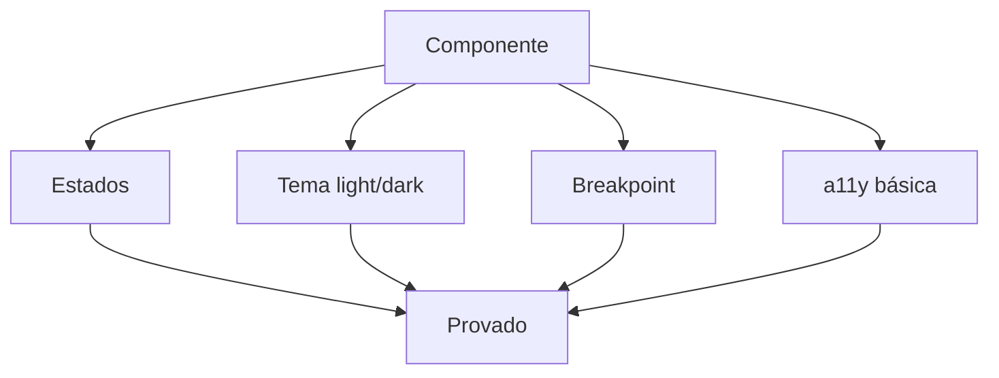

# Storybook e matriz de variantes

[⌂ Curso](../README.md) · [↑ M3](../modulos/M3.md) · [← Anterior](13-storybook-install-e-stories.md) · [Próxima →](15-governanca-e-permissoes.md)

[⌂ Curso](../README.md) · [↑ M2](../modulos/M2.md) · [← Anterior](12-stack-tailwind-shadcn-storybook.md) · [Próxima →](18-portao-qualidade-visual.md)

## Resultado

Você define a matriz mínima de variantes de um componente (estado × tema × breakpoint × a11y) e o que conta como “provado”.

## Mapa visual



## Quando usar — e quando não usar

**Use** antes de chamar um componente de “pronto para o agente reusar”.

**Não use** para esperar cobertura visual enterprise no dia 1. Matriz **mínima** > zero.

## Variante = especificação

Se só existe “Button default no desktop claro”, você não tem componente — tem **screenshot feliz**.

### Matriz mínima sugerida

| Eixo | Mínimo |
|------|--------|
| Estado | default, hover/focus (descrito), disabled, loading se existir |
| Tema | light + dark **ou** “dark N/A” justificado |
| Breakpoint | mobile + desktop (ou “só desktop” justificado) |
| a11y | contraste do par de cores; foco visível; nome acessível |

Storybook (quando existir) materializa isso. **Neste curso**, a matriz documentada já conta como evidência se você não tiver Storybook rodando.


## Âncora no acervo

`squads/design-ops/` — auditoria, regressão visual e Storybook na operação.

## Prática

Para o `Button` do seu DESIGN.md (ou outro átomo), preencha:

| Estado | Light | Dark | Mobile | a11y nota |
|--------|-------|------|--------|-----------|
| default | | | | |
| disabled | | | | |
| (outro) | | | | |

Marque o que já está **provado** vs **só imaginado**.


## Pergunte ao seu agente

```text
Gere stories/descrições de variantes para este componente a partir da matriz. Não invente props que não estão no DESIGN.md. Liste o que falta provar.
```

## Evidência de conclusão

Matriz preenchida com pelo menos 2 estados e 1 eixo tema ou breakpoint + 1 nota a11y.

## Navegação

[⌂ Curso](../README.md) · [↑ M3](../modulos/M3.md) · [← Anterior](13-storybook-install-e-stories.md) · [Próxima →](15-governanca-e-permissoes.md)

[⌂ Curso](../README.md) · [↑ M2](../modulos/M2.md) · [← Anterior](12-stack-tailwind-shadcn-storybook.md) · [Próxima →](18-portao-qualidade-visual.md)
