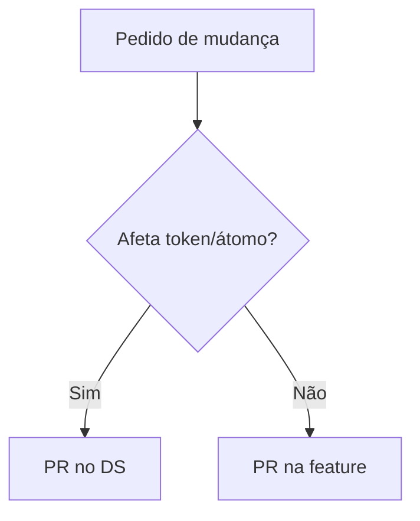

# Governança e permissões do design system

[⌂ Curso](../README.md) · [↑ M4](../modulos/M4.md) · [← Anterior](14-storybook-variantes.md) · [Próxima →](16-ds-multi-produto.md)

## Resultado

Você define quem pode alterar tokens, átomos e telas sem matar o sistema.

## Mapa visual



## Quando usar — e quando não usar

**Use** em time >1 ou com agentes gerando UI.

**Não use** burocracia para time solo no dia 1 — mas registre a regra.

## Quem mexe no quê

| Papel | Pode | Não pode |
|-------|------|----------|
| Consumidor de tela | Usar componentes do catálogo | Inventar token na página |
| Mantenedor do DS | Tokens, átomos, stories | Merge sem prova de variante |
| Agente de UI | Compor a partir do SoT | Criar átomo sem atualizar contrato |

## Pastas e permissões (ideia)

Nas lives: separar **criação/governança** do DS de **consumo** nas features reduz drift. Se todo mundo edita o Button “só um pouquinho”, o sistema morre.

## Fluxo mínimo de mudança

Criar responde “como materializar?”. Governar responde quem decide, qual evidência promove uma exceção e como consumidores migram.

```text
necessidade → proposta → consumidores/evidência → review do owner
  → aceitar no core | manter local | rejeitar com justificativa
  → versão → migração → depreciação → prova
```

| Papel | Pode | Não pode sozinho |
|---|---|---|
| consumidor | usar, reportar e propor | alterar contrato canônico |
| contribuidor | implementar proposta aceita | promover sem review |
| owner | aprovar, versionar e depreciar | ignorar impacto nos consumidores |
| design-ops | auditar processo e conformidade | redefinir marca sem owner de brand |

Agentes seguem a mesma separação: conseguir editar o arquivo não significa ter autoridade para mudar o contrato.

### Conteúdo de um mini-RFC

1. problema e consumidores afetados;
2. proposta e alternativa local considerada;
3. evidência visual e de acessibilidade;
4. owner e aprovadores;
5. versão e plano de migração;
6. prazo de depreciação;
7. rollback.

## Âncora no acervo

`squads/design-ops/` (governar no tempo). `skills/design-ops`. Aula 19 para skill vs squad.

## Prática

Escreva um RACI — quem é **R**esponsável, quem **A**prova, quem é **C**onsultado e quem é apenas **I**nformado — para novo token, novo átomo, nova página e exceção de campanha. Depois produza um mini-RFC (o formato de 7 itens da seção acima) de alteração do `Button` com versão, migração e rollback.

## Pergunte ao seu agente

```text
Proponha regras de governança para um time de 3 (dev, designer, agente). Inclua o que exige PR no DS. Seja curto.
```

## Evidência de conclusão

RACI + mini-RFC. Passou se a autoridade é explícita, a campanha não exige fork e existe caminho de migração.

## Navegação

[⌂ Curso](../README.md) · [↑ M4](../modulos/M4.md) · [← Anterior](14-storybook-variantes.md) · [Próxima →](16-ds-multi-produto.md)
