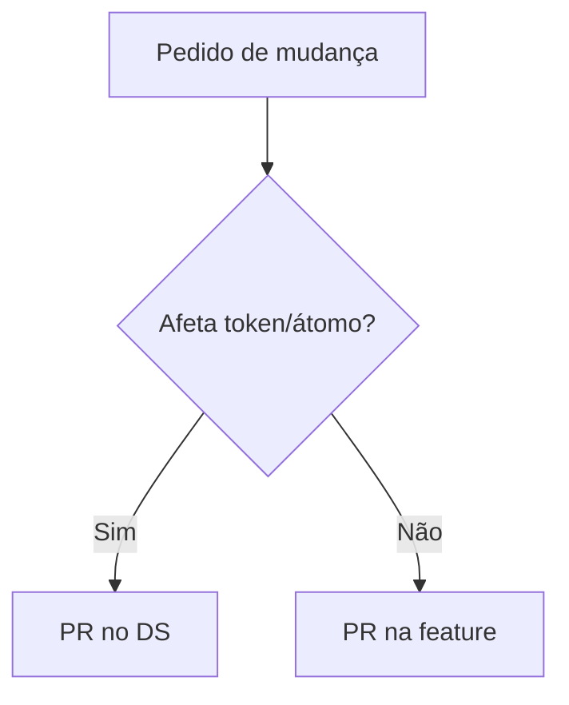

# Governança e permissões do design system

[⌂ Curso](../README.md) · [↑ M4](../modulos/M5.md) · [← Anterior](14-storybook-variantes.md) · [Próxima →](16-ds-multi-produto.md)

## Resultado

Você define quem pode alterar tokens, átomos e telas sem matar o sistema.

## Mapa visual



## Quando usar — e quando não usar

**Use** em time >1 ou com agentes gerando UI.

**Não use** burocracia para time solo no dia 1 — mas registre a regra.

## Quem mexe no quê

| Papel | Pode | Não pode |
|-------|------|----------|
| Consumidor de tela | Usar componentes do catálogo | Inventar token na página |
| Mantenedor do DS | Tokens, átomos, stories | Merge sem prova de variante |
| Agente de UI | Compor a partir do SoT | Criar átomo sem atualizar contrato |

## Pastas e permissões (ideia)

Nas lives: separar **criação/governança** do DS de **consumo** nas features reduz drift. Se todo mundo edita o Button “só um pouquinho”, o sistema morre.

## Âncora no acervo

`squads/design-ops/` (governar no tempo). `skills/design-ops`. Aula 19 para skill vs squad.

## Prática

Escreva RACI simples (Responsible/Accountable) para: novo token; novo átomo; nova página; exceção visual de campanha.

## Pergunte ao seu agente

```text
Proponha regras de governança para um time de 3 (dev, designer, agente). Inclua o que exige PR no DS. Seja curto.
```

## Evidência de conclusão

RACI de 4 linhas de mudança. Passou se campanha pontual não exige fork do DS.

## Navegação

[⌂ Curso](../README.md) · [↑ M4](../modulos/M5.md) · [← Anterior](14-storybook-variantes.md) · [Próxima →](16-ds-multi-produto.md)
