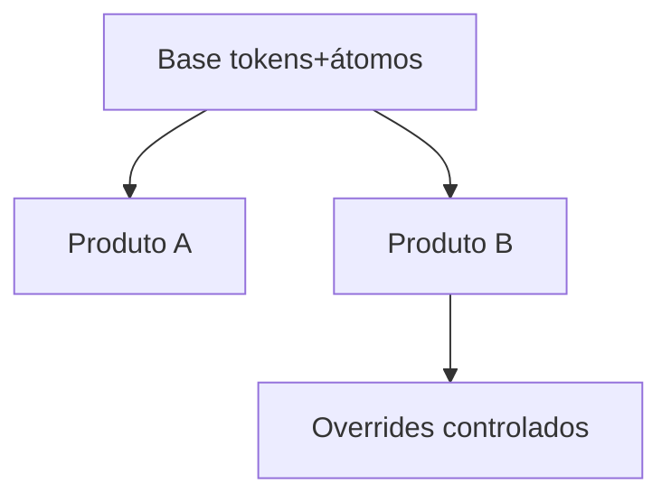

# Design system compartilhado entre produtos

[⌂ Curso](../README.md) · [↑ M4](../modulos/M4.md) · [← Anterior](15-governanca-e-permissoes.md) · [Próxima →](17-ciclo-screenshot-correcao.md)

## Resultado

Você desenha base compartilhada vs overrides entre dois produtos.

## Mapa visual



## Quando usar — e quando não usar

**Use** com 2+ produtos da mesma marca.

**Não use** se ainda não há um produto estável.

## O problema

Vários apps (ou módulos) da mesma empresa: cada um “tem seu DS” → tokens divergem, marca parte, IA multiplica variantes.

## Padrão

1. **Base compartilhada** (tokens + átomos canônicos).  
2. **Derivados** por produto (temas, densidades, poucos overrides).  
3. Proibir fork completo sem decisão explícita.

## Três camadas de decisão

1. **Foundations compartilhadas:** espaçamento, tipografia estrutural, acessibilidade, motion base e contratos comuns.
2. **Semântica de marca/tema:** `color.action`, `font.display`, radius e assinatura que variam sem mudar a responsabilidade.
3. **Extensão de produto:** componentes ou padrões que só fazem sentido em um domínio.

Tokens semânticos protegem consumidores. `color.action` pode resolver para valores diferentes por marca; `Button` continua expressando a mesma função. Compartilhar valores brutos espalhados acopla produtos ao detalhe errado.

### Quando promover uma extensão ao core

- existem ao menos dois consumidores reais;
- a responsabilidade é equivalente nos dois contextos;
- a API não carrega nome específico de domínio;
- há owner para manter compatibilidade;
- compartilhar custa menos que duplicar.

Sem essas condições, manter local não é fracasso. É isolamento consciente. O erro simétrico é criar plataforma corporativa antes do segundo consumidor ou copiar o sistema inteiro por produto.

## Caso de campo (cohort)

FAQ da turma: design system em monorepo multi-produto — base + derivados; DESIGN.md/Storybook como contrato; não reinventar tokens em cada app.

## Âncora no acervo

`cursos/AIOX Advanced/cohort-insights/FAQ-cohort.md` §7 · este curso.

## Prática

Desenhe dois produtos em foundations, tema e extensão. Liste cinco decisões compartilhadas, três overrides, uma extensão local e a regra que permitiria promovê-la ao core.

## Pergunte ao seu agente

```text
Com produto A e B (descrevo), proponha base vs override. Flag de risco se eu forkar o Button.
```

## Evidência de conclusão

Mapa core → tema → produto com decisões de compartilhamento e promoção justificadas.

## Navegação

[⌂ Curso](../README.md) · [↑ M4](../modulos/M4.md) · [← Anterior](15-governanca-e-permissoes.md) · [Próxima →](17-ciclo-screenshot-correcao.md)
