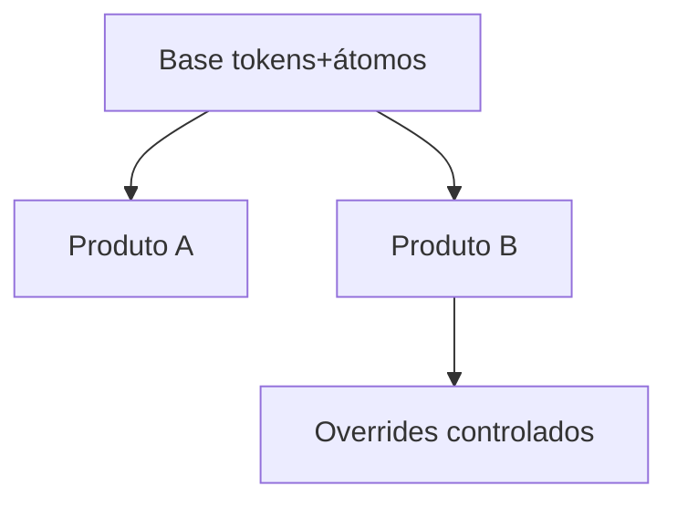

# Design system compartilhado entre produtos

[⌂ Curso](../README.md) · [↑ M4](../modulos/M5.md) · [← Anterior](15-governanca-e-permissoes.md) · [Próxima →](17-ciclo-screenshot-correcao.md)

## Resultado

Você desenha base compartilhada vs overrides entre dois produtos.

## Mapa visual



## Quando usar — e quando não usar

**Use** com 2+ produtos da mesma marca.

**Não use** se ainda não há um produto estável.

## O problema

Vários apps (ou módulos) da mesma empresa: cada um “tem seu DS” → tokens divergem, marca parte, IA multiplica variantes.

## Padrão

1. **Base compartilhada** (tokens + átomos canônicos).  
2. **Derivados** por produto (temas, densidades, poucos overrides).  
3. Proibir fork completo sem decisão explícita.

## Caso de campo (cohort)

FAQ da turma: design system em monorepo multi-produto — base + derivados; DESIGN.md/Storybook como contrato; não reinventar tokens em cada app.

## Âncora no acervo

`cursos/AIOX Advanced/cohort-insights/FAQ-cohort.md` §7 · este curso.

## Prática

Desenhe 2 produtos: o que fica na base vs o que pode ser override. Liste 3 tokens que **nunca** podem divergir.

## Pergunte ao seu agente

```text
Com produto A e B (descrevo), proponha base vs override. Flag de risco se eu forkar o Button.
```

## Evidência de conclusão

Diagrama base/override + 3 tokens imutáveis entre produtos.

## Navegação

[⌂ Curso](../README.md) · [↑ M4](../modulos/M5.md) · [← Anterior](15-governanca-e-permissoes.md) · [Próxima →](17-ciclo-screenshot-correcao.md)
