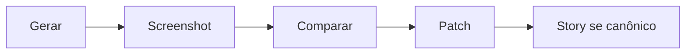

# Ciclo screenshot → comparação → correção

[⌂ Curso](../README.md) · [↑ M4](../modulos/M5.md) · [← Anterior](16-ds-multi-produto.md) · [Próxima →](18-portao-qualidade-visual.md)

## Resultado

Você executa um ciclo screenshot → comparação → patch no lugar certo.

## Mapa visual



## Quando usar — e quando não usar

**Use** em todo PR visual relevante.

**Não use** como substituto de testes automatizados quando eles existirem.

## Loop visual

```text
Gerar ou alterar UI → screenshot → comparar com referência/contrato
        → patch no componente/token OU corrigir a tela
        → atualizar story se o padrão for canônico
```

## Por que importa

Sem comparação, “fica bonito” é opinião. Com screenshot + critério, o agente e o humano fecham o loop.

## Âncora no acervo

Aula 18 (portão). `impeccable` só depois de conformidade.

## Prática

Faça **um** ciclo completo em um botão ou card: print antes/depois + 1 linha do que mudou no contrato ou na tela.

## Pergunte ao seu agente

```text
Com estes dois screenshots e o DESIGN.md, liste diffs e diga se o patch é na tela, no token ou na story.
```

## Evidência de conclusão

Par antes/depois + classificação do patch.

## Navegação

[⌂ Curso](../README.md) · [↑ M4](../modulos/M5.md) · [← Anterior](16-ds-multi-produto.md) · [Próxima →](18-portao-qualidade-visual.md)
