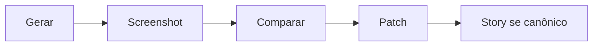

# Ciclo screenshot → comparação → correção

[⌂ Curso](../README.md) · [↑ M4](../modulos/M4.md) · [← Anterior](16-ds-multi-produto.md) · [Próxima →](18-portao-qualidade-visual.md)

## Resultado

Você executa um ciclo screenshot → comparação → patch no lugar certo.

## Mapa visual



## Quando usar — e quando não usar

**Use** em todo PR visual relevante.

**Não use** como substituto de testes automatizados quando eles existirem.

## Loop visual

```text
Gerar ou alterar UI → screenshot → comparar com referência/contrato
        → patch no componente/token OU corrigir a tela
        → atualizar story se o padrão for canônico
```

## Por que importa

Sem comparação, “fica bonito” é opinião. Com screenshot + critério, o agente e o humano fecham o loop.

## Captura reproduzível

Fixe antes de capturar:

- viewport e escala do dispositivo;
- tema;
- dados e estado;
- fontes carregadas;
- animações desativadas ou estabilizadas;
- rota e versão do componente;
- baseline aprovado.

Playwright, Chromatic ou outra ferramenta podem automatizar a superfície. O contrato de captura importa mais que a marca da ferramenta.

### Classifique antes de corrigir

| Tipo | Exemplo | Ação |
|---|---|---|
| regressão | token mudou sem intenção | corrigir e recapturar |
| mudança intencional | nova hierarquia aprovada | registrar e atualizar baseline |
| ruído | antialiasing, fonte ou timing | estabilizar ambiente/tolerância |
| lacuna de contrato | não há baseline do erro | adicionar caso antes de aprovar |

Nunca atualize o baseline apenas para o teste ficar verde. Primeiro prove por que a mudança é válida. E não use screenshot como único juiz: uma imagem idêntica ainda pode falhar em teclado, semântica ou leitor de tela.

## Âncora no acervo

Aula 18 (portão). `impeccable` só depois de conformidade.

## Prática

Faça um ciclo com dois estados e dois viewports: matriz de render (a tabela estado × viewport com a captura de cada célula), baseline (a captura aprovada como referência), candidata, findings classificados, uma correção e nova captura.

## Pergunte ao seu agente

```text
Com estes dois screenshots e o DESIGN.md, liste diffs e diga se o patch é na tela, no token ou na story.
```

## Evidência de conclusão

Matriz de render + antes/depois de pelo menos uma correção + decisão registrada sobre o baseline.

## Navegação

[⌂ Curso](../README.md) · [↑ M4](../modulos/M4.md) · [← Anterior](16-ds-multi-produto.md) · [Próxima →](18-portao-qualidade-visual.md)
