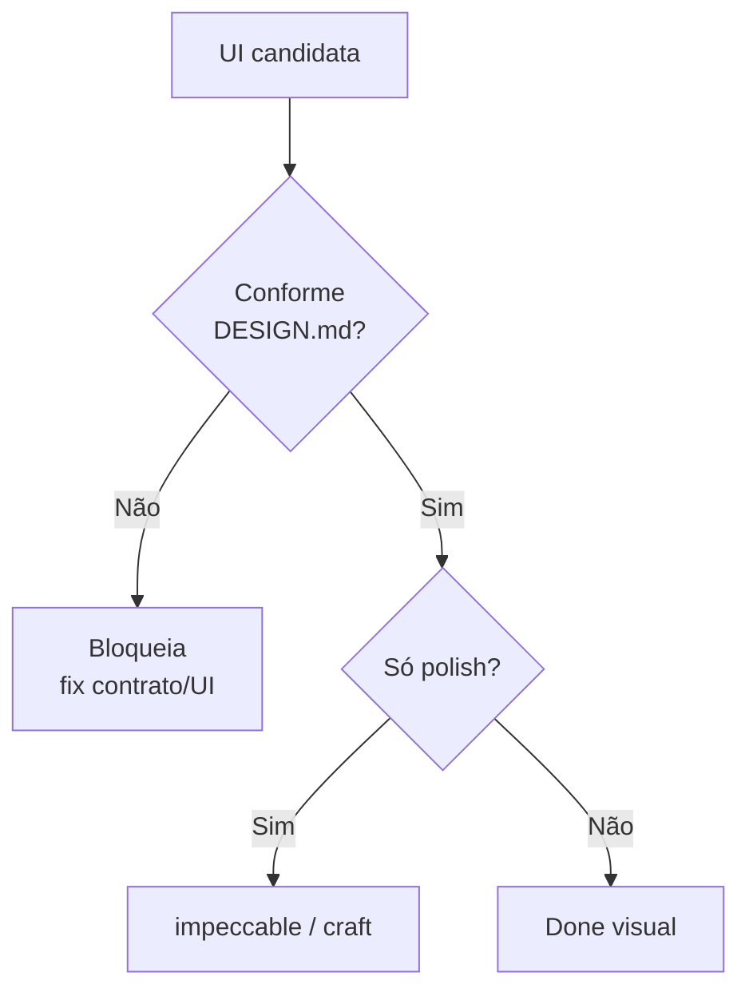

# Portão de qualidade visual (antes do craft)

[⌂ Curso](../README.md) · [↑ M4](../modulos/M5.md) · [← Anterior](17-ciclo-screenshot-correcao.md) · [Próxima →](19-skill-vs-squad-design.md)

[⌂ Curso](../README.md) · [↑ M2](../modulos/M2.md) · [← Anterior](14-storybook-variantes.md) · [Próxima →](19-skill-vs-squad-design.md)

## Resultado

Você separa o que **bloqueia** “pronto”, o que pode **waiver**, e o que é só **polish** — e coloca `impeccable` depois da conformidade.

## Mapa visual



## Quando usar — e quando não usar

**Use** em review de PR/story com UI gerada por IA.

**Não use** polish para esconder violação de token (“fica bonito depois”).

## Conformance vs craft

| Camada | Pergunta | Ferramenta mental |
|--------|----------|-------------------|
| Portão | Viola o contrato? | DESIGN.md + matriz |
| Waiver | Exceção documentada? | Motivo + prazo |
| Craft | Como elevar gosto **já conforme**? | `impeccable` |

### Exemplos de severidade

- Hex fora do token → **bloqueia**
- Falta dark mode na landing de marketing com prazo → **waiver** com data
- Micro-animação do botão → **polish**

**Frase de ouro:** impeccable **depois** do gate, nunca no lugar do DESIGN.md.


## Âncora no acervo

`skills/impeccable/SKILL.md` (portable) = craft pós-gate. Governança e auditoria: `skills/design-ops/SKILL.md` e `squads/design-ops/` (aula Squads 15).

## Prática

Classifique estes 3 findings:

1. Botão primary com `#ff00aa` hardcoded.
2. Sombra do card 2px mais suave que o token, em 1 tela.
3. Falta estado disabled na story, mas o código tem disabled.

Para cada: bloqueia / waiver / polish + ação em 1 linha.


## Pergunte ao seu agente

```text
Revise esta UI contra o DESIGN.md que vou colar. Separe findings em BLOQUEIA, WAIVER, POLISH. Não misture sugestões de "ficar mais bonito" com violações de contrato.
```

## Evidência de conclusão

Três findings classificados + a frase de ouro reescrita com suas palavras.

## Navegação

[⌂ Curso](../README.md) · [↑ M4](../modulos/M5.md) · [← Anterior](17-ciclo-screenshot-correcao.md) · [Próxima →](19-skill-vs-squad-design.md)

[⌂ Curso](../README.md) · [↑ M2](../modulos/M2.md) · [← Anterior](14-storybook-variantes.md) · [Próxima →](19-skill-vs-squad-design.md)
