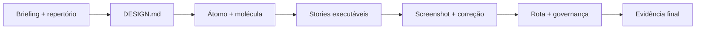

# Capstone: materializar o DS no Storybook

[⌂ Curso](../README.md) · [↑ M5](../modulos/M5.md) · [← Anterior](19-skill-vs-squad-design.md) · → fim

## Resultado

Você materializa um design system mínimo executável: contrato, um átomo, uma molécula, Storybook com variantes e um ciclo visual comprovado.

## Mapa visual



## Quando usar — e quando não usar

**Use** para fechar o curso ou para destravar UI de um projeto real em um ciclo curto.

**Não use** para prometer Chromatic, CI visual ou dezenas de componentes no mesmo ciclo. O escopo mínimo é pequeno, mas precisa rodar.

## Pacote de entrega

1. **Briefing e repertório:** usuário, tarefa, restrições, referências e proibições.
2. **DESIGN.md:** princípios, tokens semânticos, componentes canônicos e regras para agentes.
3. **Implementação:** pelo menos um átomo e uma molécula consumindo o contrato.
4. **Storybook local:** stories dos estados mínimos, tema/breakpoint pertinente e evidência de acessibilidade.
5. **Loop visual:** screenshot inicial, finding classificado, correção e screenshot final.
6. **Operação:** rota skill/squad, maturidade, owner e regra de mudança.
7. **Autocrítica:** lacunas para produção e próximo incremento.

## Definition of Done

**Storybook local rodando é obrigatório para aprovação.**

- `DESIGN.md` legível por humanos e agentes.
- Um átomo e uma molécula implementados sem hardcode fora do contrato.
- Storybook local rodando com as stories mínimas.
- Um ciclo screenshot → comparação → correção documentado.
- Zero falha crítica da [Rubrica](../Rubrica.md).
- Rota operacional e anti-escopo honestos.

**Bloqueio de ambiente não é conclusão:** registre o bloqueio e o próximo passo técnico, mas o capstone só fecha quando o Storybook roda. Chromatic e CI visual permanecem opcionais.


## Âncora no acervo

- Contrato: `skills/design-md/SKILL.md` (validar/manter DESIGN.md no projeto destino).
- Construir biblioteca: `squads/design-system/` · governar: `squads/design-ops/` · marca: `squads/brand/`.
- Craft pós-gate: `skills/impeccable/SKILL.md`.
- Hub deste curso: [README](../README.md) · operação com briefing: `cursos/AIOX-Advanced-Squads/aulas/14-design-system.md` e `15-design-ops.md` (paths monoespaçados; curso irmão).

## Prática

Execute o pacote acima no **seu** produto. Se não houver produto, use o cenário “agenda colaborativa”: formulário de novo evento, `Button` e `EventForm` como átomo e molécula.

Salve em `notas/` (não sobrescreva aulas canônicas).


## Pergunte ao seu agente

```text
Vou fornecer meu repositório e as evidências do capstone AIOX Design. Verifique DESIGN.md, átomo, molécula, stories, variantes, screenshot antes/depois, governança e rota operacional. Aplique a rubrica, declare falhas críticas e indique o menor patch para aprovação. Não aceite documento no lugar de Storybook rodando.
```

## Evidência de conclusão

Repositório executável + URL local ou log do Storybook + stories + screenshots antes/depois + autoavaliação pela rubrica.

## Navegação

[⌂ Curso](../README.md) · [↑ M5](../modulos/M5.md) · [← Anterior](19-skill-vs-squad-design.md) · → fim
