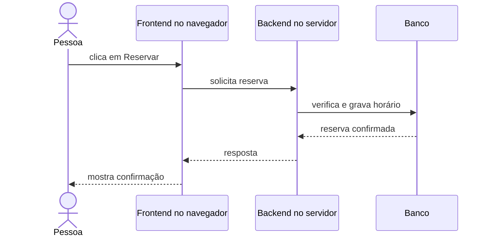

# Cliente, servidor, frontend e backend

## Resultado

Você consegue seguir uma interação da interface até o código servidor e explicar por que “frontend/backend” e “cliente/servidor” são relações, não marcas de tecnologia.

## Mapa visual



## Modelo mental

**Cliente** é quem inicia uma solicitação; **servidor** é quem oferece a capacidade e responde. O mesmo software pode ser servidor em uma relação e cliente em outra: seu backend serve o navegador, mas vira cliente ao chamar um gateway de pagamento.

**Frontend** é a parte próxima da interação: apresenta informações, captura intenção e mantém estado de interface. **Backend** executa regras, integrações e persistência que não devem depender do dispositivo do usuário.

Não confunda “backend” com “banco”. O backend é o responsável por decidir e coordenar; o banco é uma dependência para persistir estado.

## Quando usar — e quando não usar

Use a distinção para decidir onde uma validação ou segredo deve viver, para localizar uma falha e para entender latência. Regra que protege dinheiro ou autorização não pode depender apenas do frontend, porque o cliente está sob controle do usuário.

Não use a divisão como dogma. Uma aplicação local pode não ter servidor remoto; uma função serverless continua assumindo papel de backend; um app pode renderizar parte da interface no servidor. O importante é responsabilidade e confiança.

## Caso rápido

Num checkout, o frontend pode verificar que o campo de cartão parece preenchido e oferecer feedback rápido. O backend precisa recalcular preço, verificar estoque e autorizar pagamento. Se o frontend enviar “total = 1”, o backend não deve confiar: ele conhece a regra e a fonte de verdade.

Anti-padrão: colocar credencial secreta no frontend. Tudo que chega ao dispositivo do usuário deve ser tratado como potencialmente observável e modificável.

## Prática

Escolha uma ação do seu produto e faça três colunas:

- frontend: o que mostra e captura;
- backend: o que valida e decide;
- dependências: onde lê, grava ou chama serviços.

Marque cada dado em que o backend não pode confiar sem revalidar.

## Pergunte ao seu agente

```text
Para a ação abaixo, separe responsabilidades de frontend, backend e dependências. Marque fronteiras de confiança e diga quais validações precisam ser repetidas no servidor. Use um sequence diagram pequeno.
```

## Evidência de conclusão

Fluxo no qual cada regra importante tem um lado responsável e nenhuma credencial ou decisão crítica depende apenas do cliente.

Fonte: [MDN — Client-server overview](https://developer.mozilla.org/en-US/docs/Learn_web_development/Extensions/Server-side/First_steps/Client-Server_overview).

[Anterior](01-sistema-componentes-fronteiras.md) · [Próxima: HTTP e API](03-http-request-response-api.md)
