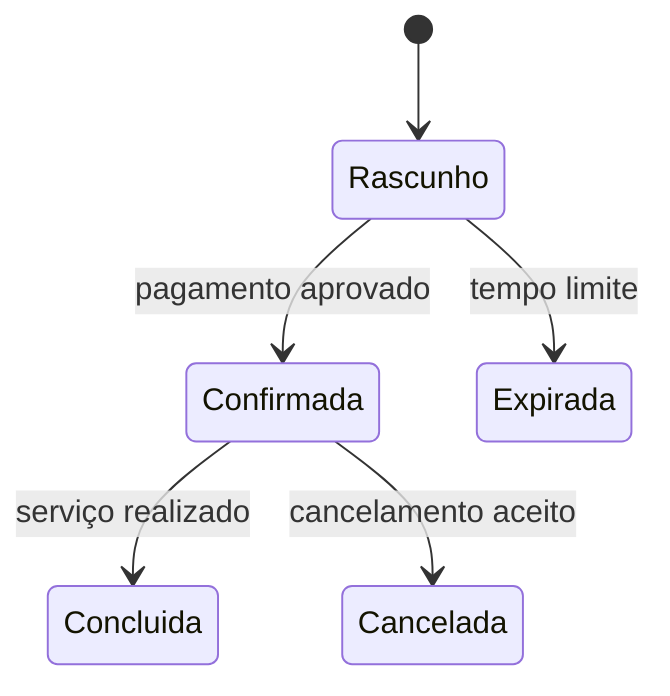

# Estado, entidade e ciclo de vida

## Resultado

Você identifica quais informações precisam sobreviver entre operações e modela a coisa do negócio antes de escolher tabela ou ferramenta.

## Mapa visual



## Modelo mental

**Estado** é informação necessária para interpretar o presente ou continuar o trabalho no futuro. A lista de itens de um carrinho, o status de uma reserva e o último checkpoint de um job são estado.

Uma **entidade** é uma coisa do domínio que mantém identidade ao longo de mudanças: a Reserva `R-123` continua a mesma ao passar de rascunho para confirmada. Seu **ciclo de vida** descreve nascimento, transições válidas e encerramento.

Componente **stateless** não guarda localmente a verdade necessária entre requests. Isso não significa “sistema sem estado”: o estado pode viver no banco, fila ou storage, permitindo que diferentes instâncias processem solicitações.

## Quando usar — e quando não usar

Modele ciclo de vida quando status muda, há regras por fase ou várias partes precisam concordar sobre “onde está”. Pergunte primeiro “o que nasce, muda e termina?”; só depois desenhe tabelas.

Não crie entidade para qualquer substantivo. Um valor sem identidade ou ciclo próprio pode ser apenas atributo. Também não use uma coluna `status` sem definir transições: ela vira texto livre que permite estados impossíveis.

## Caso rápido

Um documento processado por IA pode ter estados `recebido → extraindo → aguardando revisão → aprovado` ou `falhou`. Se o worker cai em `extraindo`, o checkpoint precisa permitir retomada. Sem ciclo explícito, o sistema não sabe se reprocessa, aguarda ou duplica.

Anti-padrão: tratar a tela como fonte de verdade. Fechar o navegador não pode apagar uma reserva confirmada.

## Prática

Escolha uma entidade do seu sistema e registre:

- identidade estável;
- dados essenciais;
- cinco estados no máximo;
- eventos que mudam o estado;
- transições proibidas;
- quando pode ser arquivada ou removida.

## Pergunte ao seu agente

```text
Revise este ciclo de vida. Encontre estados ambíguos, transições impossíveis, eventos sem dono e situações de queda/repetição. Não proponha schema ainda; devolva primeiro a máquina de estados corrigida.
```

## Evidência de conclusão

Máquina de estados em que cada transição possui evento, regra e resultado; outra pessoa consegue explicar o que acontece após interrupção.

Fonte: [PostgreSQL — Tutorial](https://www.postgresql.org/docs/current/tutorial.html). Proveniência: [mapeamento curricular](../PROVENIENCIA.md).

[Anterior](03-http-request-response-api.md) · [Próxima: banco](05-banco-schema-indice-transacao.md)
