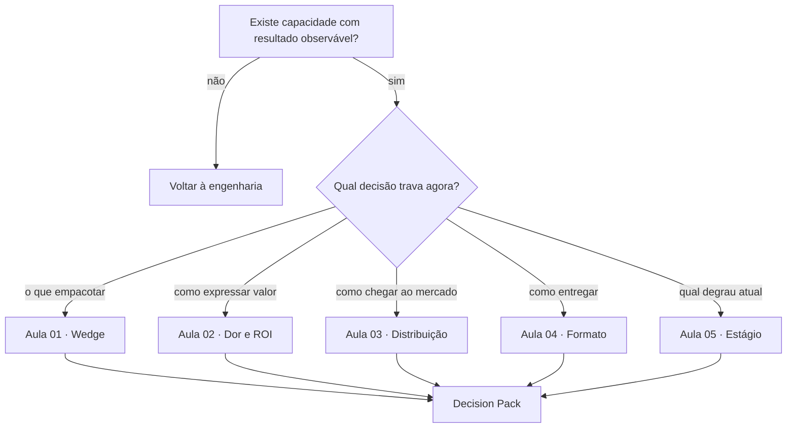

# Mapa de decisão — AIOX Productização

## Comece pela lacuna, não pela aula

## Rotas rápidas

| Situação observada | Rota | Não faça ainda |
|--------------------|------|----------------|
| Serviço amplo, customizado e difícil de explicar | [Aula 01](aulas/01-service-as-software.md) | Construir plataforma completa |
| Pitch descreve IA, agentes e stack | [Aula 02](aulas/02-dor-e-roi.md) | Adicionar mais features ao pitch |
| Muito build, poucas conversas | [Aula 03](aulas/03-distribuicao-vs-produto.md) | Abrir cinco canais ao mesmo tempo |
| Consultoria paga, desejo de SaaS | [Aula 04](aulas/04-caminhos-de-produto.md) | Migrar de formato sem gatilho |
| Uso interno chamado de “produto” | [Aula 05](aulas/05-estagios-de-monetizacao.md) | Confundir dogfood com demanda |
| Cinco decisões já preenchidas | [Projeto integrador](Projeto-Integrador.md) | Testar peças contraditórias separadamente |

## Ordem de perguntas

Quando tudo parece misturado, responda nesta ordem:

1. Qual resultado já aconteceu?
2. Para quem esse resultado importa?
3. Qual parte se repete com fronteira de pronto?
4. Que dor e baseline existem?
5. Como essa pessoa descobrirá a oferta?
6. Qual formato reduz risco agora?
7. Que prova falta para subir de estágio?

## Regra de parada

Se a primeira pergunta não possui resposta verificável, pare a productização. Volte à capacidade técnica ou execute um caso real antes de discutir canal, SaaS ou escala.
