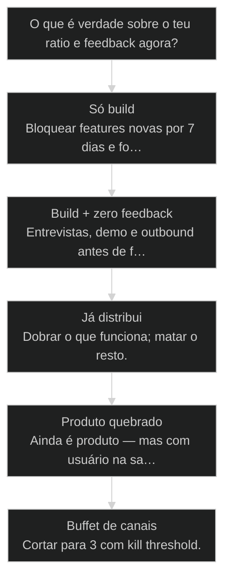
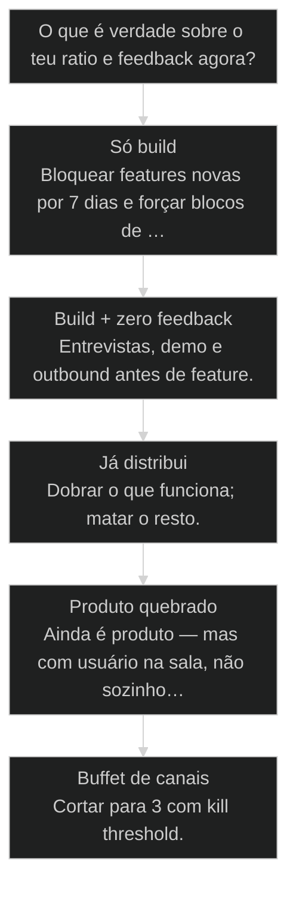

# Distribuição > Produto (10/90)


## Mapa desta aula

Decisão-chave da aula — O que é verdade sobre o teu ratio e feedback agora?



> Leia o diagrama antes do texto longo. Depois volte e confira.

> Construir ficou barato com IA. Distribuir continua caro em atenção humana. Audite teu ratio — e reescreva a semana.

**Objetivos de aprendizagem:**
- Auditar o percentual real de tempo em construção vs distribuição na última semana. _(analyze)_
- Re-alocar uma semana de trabalho para um ratio 10/90 mais honesto e executável. _(apply)_
- Listar 3 canais de distribuição com hipótese testável e kill threshold. _(evaluate)_
- Bloquear features de vaidade quando o canal ainda não gerou feedback. _(apply)_

---

## O que você consegue no fim desta aula

*G · Destino*

Destino claro antes de qualquer mantra de growth.

Ao final desta aula você vai conseguir três coisas concretas:

1. Dizer teu **ratio real** da semana passada (build : distribuição) sem se enganar.
2. Colocar **três ações de distribuição** na agenda — com hora, não com "vou postar".
3. Nomear **três canais** com hipótese e critério de morte.

Se você sair daqui ainda com backlog de features e zero bloco de distribuição,
a aula falhou. Construir ficou barato. **Atenção de humano** continua cara.

- **Objetivos da aula** (Auditar ratio build vs dist; Reescrever a semana com 10/90; 3 canais com hipótese e kill)
- **Resultado tangível**: Timesheet de 7 dias + calendário da próxima semana com blocos de dist.
- **Não é o destino**: Virar growth hacker full-time. O destino é parar de esconder no repo.

---

## A caverna do repo

*P · Onde você está*

Empatia com o builder que viciou em craft.

Cara, a IA piorou um vício antigo. Antes, build doía. Agora build dá dopamine
a cada commit. Você shipa em horas o que levava semanas — e confunde velocidade
de código com progresso de negócio.

O filme clássico: sexta-feira, feature nova no ar, zero anúncio, zero demo,
zero conversa. Segunda, "ninguém usou" — e a resposta emocional é mais feature.

Se você está aqui, provavelmente já sentiu:

- Analytics vazio e orgulho do design system.
- "Quando o produto estiver pronto eu distribuo" (nunca fica pronto).
- Medo de vender o que ainda "não está perfeito".

Beleza. A partir daqui a gente trata distribuição como **trabalho de produto**,
não como etapa pós-MVP mítica.

**Onde a maioria trava**
- 90% build / 10% dist (invertido)
- Feature em vez de conversa
- Canal sem hipótese nem kill

**Onde o operador vai**
- Agenda com blocos de distribuição
- Ship + anúncio no mesmo ciclo
- 3 canais com métrica e prazo

---

## O que é distribuição (de verdade)

*S · Rota*

Não é só ads. É tudo que move saber → querer → usar.

**Distribuição** é o conjunto de atos que fazem alguém certo **saber** que
existe, **querer** e **chegar** no valor: conteúdo, outbound, parceria,
community, product-led loops, demo, sales, referral.

**10 produto / 90 distribuição** não é contabilidade sagrada. É provocação
pra sair da caverna do repo. Em early stage, se você não está desconfortável
com quanto tempo gasta "só construindo", você provavelmente está escondido.

Prior-art: a aula de Service-as-Software (62) te deu o wedge. Esta aula força
o wedge a **encontrar humano**. Sem isso, SaS vira hobby bem arquitetado.

- **10**: produto (provocação)
- **90**: distribuição (provocação)
- **0**: desculpa de 'ainda não'

- **status**: distribuicao-vs-produto
- **meta**: ratio=build:dist
- **meta**: unidade=hora na agenda
- **ready**: ready to audit

**Legenda de cores**

O que cada cor sinaliza nesta aula

- **Distribuição** (signal): saber → querer → usar
- **10/90** (insight): provocação de alocação
- **Canal** (bench): hipótese + kill threshold
- **Agenda** (action): bloco com hora e dono
- **Craft trap** (pain): feature como fuga

**Como ler esta aula**

1. **Definição**: Distribuição operacional, não mantra.
2. **Armadilha**: Craft trap com IA.
3. **Caso**: Quem reverteu o ratio e o que mudou.
4. **Rota**: Auditoria + canais + semana.

---

## A armadilha do craft (e por que a IA piora)

Build vicia. Distribuição confronta.

Craft trap: preferir o trabalho em que você se sente competente (código, design,
prompt) em vez do trabalho que gera tração (conversa, oferta, follow-up).

A IA multiplica o craft trap:

- Diff lindo em minutos → sensação de progresso.
- Feature "quase pronta" → desculpa pra não mostrar.
- Mais agentes no squad → sensação de escala sem um usuário novo.

Distribuição confronta: rejeição, silêncio, "não agora". É por isso que o
cérebro prefere mais um refactor. O operador maduro **agenda a confrontação**
— não espera motivação.

Regra prática: se o ship da semana não tem anúncio, demo ou conversa marcada,
você não shipou produto — shipou hobby versionado.

> **Lei do ship com testemunha**: Todo ship precisa de pelo menos um humano externo que soube. Sem testemunha, é diário de engenharia.

- **Velocidade de build** != **Progresso de negócio**: Um é commits; o outro é atenção e conversão.
- **Canal** != **Tática solta**: Canal tem hipótese, métrica e prazo; tática é post aleatório.

---

## Três canais com hipótese — não um buffet

Foco de canal é estratégia. Buffet é ansiedade.

Escolha no máximo **três canais** por ciclo (30–45 dias). Cada um com:

1. **Hipótese** — "Se eu fizer X, Y pessoas certas vão Z."
2. **Métrica** — resposta, call, trial, contrato (uma só primária).
3. **Kill threshold** — o que precisa acontecer em N dias ou você corta.

Exemplos honestos:
- Outbound de 20 ICPs/semana → 3 calls → 1 piloto.
- Conteúdo técnico 2x/semana → 10 replies qualificados → 2 demos.
- Parceria com 1 comunidade → 1 webinar → 5 trials.

O que **não** conta como canal: "estar no LinkedIn", "ter landing", "SEO
algum dia". Canal é **ritmo + oferta + métrica**.

- **Canal**: Rota repetível de alcance com hipótese, métrica e kill threshold.
- **Kill threshold**: Critério numérico e temporal que encerra o experimento sem drama.
- **Ratio 10/90**: Provocação de alocação: priorize distribuição enquanto build ficou barato.
- **Craft trap**: Preferir build confortável em vez de confrontação com mercado.

> **Prior-art**: Service-as-Software (62) define o que empacotar. Aqui você define quem vai saber que existe. Depois, dor/ROI (64) define como falar.

---

## Caso: a semana invertida

De 95/5 para algo que gera conversa — sem abandonar o craft.

Dev solo com wedge de automação de relatório. Ratio real: 95% build, 5%
"talvez eu poste". Três meses de produto "quase pronto". Zero clientes novos.

Intervenção brutal de uma semana:

1. **Congelar** features novas (exceto bug que impede demo).
2. **Timesheet honesto** — descobriu 38h build / 2h dist.
3. **Agenda**: 3 blocos de 90 min de outbound + 2 demos gravadas + 1 post com CTA.
4. **Canal**: LinkedIn outbound em ICP de ops + indicação de 5 clientes antigos do serviço.

Resultado em 14 dias: 7 conversas, 2 demos, 1 piloto pago. O produto quase
não mudou. **A exposição** mudou.

Então o que acontece se ele tivesse "só mais uma feature"? Mais duas semanas
de craft trap e a mesma planilha vazia.

**Semana de correção**

1. **Auditar**: Timesheet 7 dias
2. **Congelar**: Features de vaidade
3. **Agendar**: Blocos de dist
4. **3 canais**: Hipótese + kill
5. **Medir**: Conversas e demos

---

## Qual é a próxima ação de distribuição?

Árvore curta pra não esconder no backlog.

**Árvore de decisão**
_Escolha pela agenda real da semana passada — não pela intenção._



- **Só build** — <2h/semana de distribuição honesta.
  → _Bloquear features novas por 7 dias e forçar blocos de dist._
  Ex.: Ship sem anúncio, sem demo, sem conversa.
- **Build + zero feedback** — Produto existe, ninguém usa ou responde.
  → _Entrevistas, demo e outbound antes de feature._
  Ex.: Analytics vazio e roadmap cheio.
- **Já distribui** — Canal gera conversa ou trial de forma repetível.
  → _Dobrar o que funciona; matar o resto._
  Ex.: Outbound responde; posts orgânicos não.
- **Produto quebrado** — Retenção/uso zero mesmo com demos.
  → _Ainda é produto — mas com usuário na sala, não sozinho no repo._
  Ex.: Churn imediato ou 'legal' sem retorno.
- **Buffet de canais** — 5+ canais sem métrica.
  → _Cortar para 3 com kill threshold._
  Ex.: TikTok + ads + SEO + newsletter + cold email sem dono.

**Gate:** Você consegue dizer ratio da semana passada e a próxima ação de dist com hora? — _Se não tem hora na agenda, ainda é desejo — não plano._

#### Rota auditoria
Semana passada, sem autoengano.
1. **Timesheet: Horas build vs dist.
2. **Razão: Escreva build:dist.
3. **Ship sem testemunha: Liste os que morreram em silêncio.
4. **Diagnóstico: Craft trap ou produto quebrado?

#### Rota correção
Próximos 7 dias.
1. **3 ações dist: Com horário no calendário.
2. **1 build mínimo: Só o que desbloqueia demo.
3. **1 anúncio: Todo ship com testemunha.
4. **Medir: Conversas, demos, replies.

#### Rota canal
30 dias de experimento.
1. **Escolher 3: Não 10.
2. **Hipótese: Uma frase cada.
3. **Kill: Número + prazo.
4. **Dobrar/Matar: Sem drama no dia N.

---

## Audite e reescreva a semana (20 min)

Calendário e timesheet — não mood board.

Vamos lá. Sem agenda, o 10/90 vira tatoo de LinkedIn. Cronometra vinte minutos.

- 1. **Timesheet**: Últimos 7 dias: horas de build vs distribuição (honesto).
- 2. **Razão**: Escreva build:dist e uma frase de diagnóstico.
- 3. **3 canais**: Hipótese + métrica + kill threshold para cada um.
- 4. **Agenda**: Próximos 7 dias: 3 blocos de dist com horário e oferta.
- 5. **Freeze**: Liste 3 features que ficam bloqueadas até haver feedback externo.

**Funcionou se:**

- Ratio da semana passada está escrito com números, não adjetivos.
- Três canais têm hipótese, métrica e kill threshold.
- Há blocos de distribuição com horário na agenda da próxima semana.

---

## Glossário sem growth-washing

- **Distribuição**: Atos que movem o ICP de saber → querer → usar (não só ads).
- **Ratio 10/90**: Provocação de alocação de tempo: priorizar distribuição quando build ficou barato.
- **Kill threshold**: Critério que encerra um canal/experimento sem ego.
- **Craft trap**: Fuga para build confortável em vez de confrontação com mercado.

---

## Portão da aula

Você passou quando sabe teu ratio real e tem plano de distribuição **na agenda** —
não só no board de features. Construir é barato. Ser visto e desejado continua
o trabalho caro.

A IA é a seta. O X é seu — inclusive **sair do repo** e falar com humano.


> **GATE-MODULE (auto)**: GPS Goal/Position/Steps presentes · caso + do/dont · decisão · prática com evidência · glossário. Alvo DL ≥70 atingido na construção enrich-W4.

***


---

## Pergunte ao seu agente

```text
Use esta aula e o template experimento-distribuicao.md. Transforme minha
ideia de divulgação em uma hipótese com um público, um canal, uma mensagem,
uma ação e uma métrica. Exija kill threshold e prazo máximo de 14 dias.
Não recomende construir feature antes do teste.
```

## Evidência de conclusão

Preencha o [Experimento de distribuição](../templates/experimento-distribuicao.md) com um canal prioritário, volume, cadência, métricas e kill threshold definidos antes da execução.

## Origem curricular

Adaptação autocontida da aula 63 do AIOX Advanced. A fonte histórica permanece registrada em `source_path`; este curso é o dono da progressão atual.

## Navegação

[← Aula anterior](02-dor-e-roi.md) · [M2](../modulos/M2-distribuicao-formato-monetizacao.md) · [Curso](../README.md) · [Próxima aula →](04-caminhos-de-produto.md)
