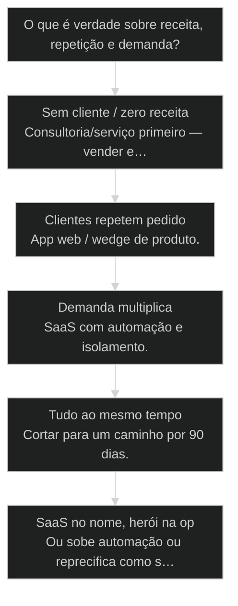
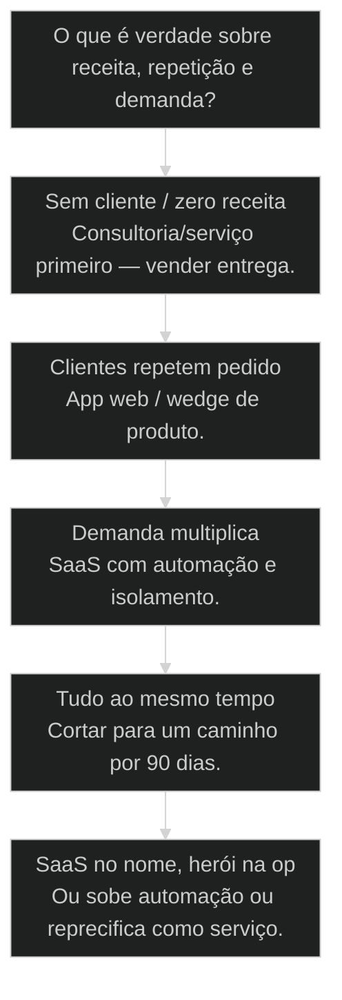

# Três caminhos de produto: Consultoria → App Web → SaaS


## Mapa desta aula

Decisão-chave da aula — O que é verdade sobre receita, repetição e demanda?



> Leia o diagrama antes do texto longo. Depois volte e confira.

> Consultoria paga a conta e valida dor. App web verticaliza. SaaS escala. Querer os três no mês 1 é suicídio de foco.

**Objetivos de aprendizagem:**
- Descrever os três caminhos e os trade-offs de margem, escala e foco de cada um. _(understand)_
- Posicionar o próprio produto em exatamente um caminho atual com evidência. _(evaluate)_
- Definir critério numérico de passagem para o próximo caminho. _(apply)_
- Cortar iniciativas que puxam para pistas paralelas sem gatilho. _(apply)_

---

## O que você consegue no fim desta aula

*G · Destino*

Destino claro antes de qualquer roadmap de três produtos.

Ao final desta aula você vai conseguir três coisas concretas:

1. Nomear **um** caminho atual (consultoria, app web ou SaaS) sem se envergonhar.
2. Explicar **por que** esse caminho agora — com evidência, não com sonho.
3. Escrever o **gatilho numérico** que autoriza mudar de pista.

Se você sair daqui ainda com "agency + SaaS + curso + app" no mesmo trimestre,
a aula falhou. Foco é o ativo. Multicaminho é vaidade cara.

- **Objetivos da aula** (Mapear 3 pistas e trade-offs; Escolher 1 caminho atual; Gatilho numérico pro próximo)
- **Resultado tangível**: Cartão: caminho agora · evidência · gatilho · 3 cortes.
- **Não é o destino**: Ser 'full stack de modelo de negócio' no mês 1.

---

## O suicídio de foco

*P · Onde você está*

Empatia com quem quer todas as pistas abertas.

Cara, o mercado te treina pra parecer grande. Slide com três linhas de receita.
LinkedIn com "consultoria + produto + comunidade". Por dentro: time de um
(ou três) tentando ser McKinsey, Linear e Notion no mesmo calendário.

Com AIOX o risco sobe: build ficou barato, então a tentação de abrir a pista
SaaS enquanto ainda vive de projeto custom é diária.

Se você está aqui, provavelmente já sentiu:

- Cliente de consultoria pedindo "virar SaaS" sem repetição de entregável.
- App web semi-custom tratado como se fosse multi-tenant.
- Preço de SaaS com custo de atendimento de consultoria.

Beleza. A partir daqui: **escolhe a pista, corre, só muda com critério**.

**Onde a maioria trava**
- Três caminhos no mesmo trimestre
- SaaS no nome, consultoria no custo
- Mudar de pista por tédio

**Onde o operador vai**
- Um caminho explícito por ciclo
- Preço alinhado ao modelo
- Gatilho numérico antes de pivotar

---

## Três pistas, três jogos

*S · Rota*

Não é hierarquia moral. É modelo operacional.

**Consultoria / serviço** — alto touch, alto ticket, aprendizado brutal de dor.
Escala com horas (até produtizar). Paga a conta e valida.

**App web vertical** — produto para um ICP, ainda pode ser semi-custom ou
high-touch onboarding. Menos herói por cliente que consultoria; mais do que SaaS.

**SaaS** — self-serve ou low-touch, multi-tenant, suporte industrializado,
preço que não quebra com o 100º usuário.

Prior-art: SaS (62) e dor/ROI (64) definem o que vender. Aqui você define
**em que modelo de entrega** isso vive agora.

- **3**: caminhos batizados
- **1**: pista ativa
- **0**: desculpa de 'fazemos tudo'

- **status**: tres-caminhos-de-produto
- **meta**: regra=uma pista ativa
- **meta**: mudanca=gatilho numerico
- **ready**: ready to position

**Legenda de cores**

O que cada cor sinaliza nesta aula

- **Consultoria** (signal): horas + ticket + validação
- **App web** (insight): produto vertical
- **SaaS** (bench): escala com isolamento
- **Gatilho** (action): número que autoriza subida
- **Multicaminho** (pain): foco fragmentado

**Como ler esta aula**

1. **Pistas**: Trade-offs de cada caminho.
2. **Passagem**: Quando subir de pista.
3. **Caso**: Quem tentou três e quebrou.
4. **Rota**: Posicionar e gatilhar.

---

## Trade-offs sem romance

Margem, escala, risco e tipo de problema de cada caminho.

**Consultoria**
+ validação rápida de dor, cash cedo, aprendizado
− escala linear com sua agenda, difícil de "pausar"
Jogo: excelência de entrega e documentação de padrões.

**App web**
+ produto reutilizável, ICP claro, ainda cabe high-touch
− precisa de UX, onboarding e suporte mínimo
Jogo: repetir o mesmo entregável sem reescrever o monstro.

**SaaS**
+ escala não-linear, valuation de produto, canais amplos
− custo de multi-tenant, suporte, billing, reliability
Jogo: automação e isolamento — não herói por cliente.

Nenhum caminho é "mais maduro" em abstrato. Maduro é **alinhar** caminho,
preço, operação e expectativa do cliente. SaaS cobrando como consultoria
(ou o inverso) é a receita clássica de burn.

- **1. Consultoria**: Horas + ticket + validação de dor. [cash]
- **2. App web**: Produto vertical, semi-custom permitido. [wedge]
- **3. SaaS**: Low-touch, multi-tenant, suporte industrial. [escala]

> **Lei da pista única**: Por ciclo (ex.: 90 dias), uma pista é dona do calendário. As outras são experimentes orçados — ou estão mortas.

- **App web** != **SaaS**: App pode ser high-touch e single-tenant; SaaS exige industrialização de suporte e isolamento.
- **Consultoria com tools** != **Produto**: Usar AIOX na entrega ainda é consultoria até o cliente operar sem você.

---

## Critério de passagem — números, não tédio

Mudar de pista por entusiasmo é como pivotar por mood.

Exemplos de gatilho (adapte — não copie como dogma):

- **Consultoria → App web**: 3+ clientes pedindo o mesmo entregável; ≥40% do
  tempo em trabalho repetível; 1 piloto topa pagar add-on de software.
- **App web → SaaS**: fila de onboarding que não cabe em horas; ≥N tenants
  com isolamento real; churn e suporte medidos; preço que sobrevive a escala.
- **Voltar de SaaS → serviço**: Stripe vazio, suporte heroico, unit economics
  quebrado — é coragem, não fracasso.

Sem gatilho escrito, você muda de pista por LinkedIn e FOMO.

- **Caminho**: Modelo de entrega e escala: consultoria, app web ou SaaS.
- **Gatilho de passagem**: Critério numérico e temporal que autoriza mudar de pista.
- **Semi-custom**: Produto com adaptação controlada — ainda não é multi-tenant genérico.
- **Multicaminho**: Operar várias pistas sem orçamento nem dono — foco morto.

---

## Caso: três pistas, zero tração

O founder que quis agency + SaaS + app no mesmo trimestre.

Time de dois. Oferta de implementação AIOX (consultoria), landing de SaaS de
"ops de conteúdo", e app semi-custom pra um vertical. Três roadmaps. Nenhuma
métrica de passagem. Resultado: cash irregular, produto eternamente beta,
e a sensação de "trabalhamos o dia inteiro sem avançar".

Correção de 90 dias:

1. **Pista única**: consultoria de implementação (o que já pagava).
2. **Documentar padrões** de todo engajamento (semente do app).
3. **Gatilho**: 4 clientes com o mesmo pacote de entregáveis + 1 pagando
   add-on automatizado → aí sim abrir app web.
4. **Cortes**: pausar branding de SaaS e features multi-tenant.

Em um trimestre o cash estabilizou e o wedge nasceu **de dentro** do serviço.
SaaS ficou no horizonte — não no calendário da semana.

**Disciplina de pista**

1. **Nomear**: Uma pista ativa
2. **Provar**: Evidência de encaixe
3. **Gatilho**: Número de passagem
4. **Cortar**: Pistas fantasmas
5. **Subir**: Só com gatilho batido

---

## Qual caminho agora?

Árvore curta pra não errar a pista.

**Árvore de decisão**
_Escolha pela operação real — não pelo slide de valuation._



- **Sem cliente / zero receita** — Só landing ou deck.
  → _Consultoria/serviço primeiro — vender entrega._
  Ex.: Produto no Figma, zero LOI.
- **Clientes repetem pedido** — Mesmo entregável 3+ vezes.
  → _App web / wedge de produto._
  Ex.: Três relatórios iguais customizados na mão.
- **Demanda multiplica** — Não cabe em horas; suporte vira gargalo.
  → _SaaS com automação e isolamento._
  Ex.: Fila de onboarding e multi-cliente no mesmo stack.
- **Tudo ao mesmo tempo** — Agency + SaaS + curso + app.
  → _Cortar para um caminho por 90 dias._
  Ex.: Quatro roadmaps, zero métrica de passagem.
- **SaaS no nome, herói na op** — Preço de produto, custo de consultoria.
  → _Ou sobe automação ou reprecifica como serviço._
  Ex.: Onboarding de 40h por tenant.

**Gate:** Você consegue nomear a pista ativa e o gatilho do próximo em uma frase cada? — _Se não nomeia, o calendário vai escolher por você — mal._

#### Rota agora
Um caminho. 90 dias.
1. **Escolher: Consultoria | App | SaaS.
2. **Evidência: Por que essa pista.
3. **Métrica: O que prova sucesso na pista.
4. **Cortes: 3 iniciativas das outras pistas.

#### Rota próximo
Critério de passagem.
1. **Gatilho: Número + prazo.
2. **Preparar: O que precisa existir antes.
3. **Orçar: Horas da transição.
4. **Transicionar: Só com gatilho batido.

#### Rota realinhamento
Modelo vs operação.
1. **Mapear custo: Horas por cliente.
2. **Mapear preço: O que cobra.
3. **Gap: Herói escondido?
4. **Ajustar: Preço, escopo ou automação.

---

## Posicione e gatilhe (15 min)

Um cartão. Sem slides de três futuros.

Vamos lá. Se ficar nos três futuros, você fica nos zero presentes. Quinze minutos.

- 1. **Caminho atual**: Nomeie exatamente um: consultoria | app web | SaaS.
- 2. **Evidência**: 3 fatos da operação (receita, horas/cliente, repetição).
- 3. **Gatilho**: O número que autorizaria subir (ou descer) de pista.
- 4. **Cortes**: Liste 3 iniciativas das outras pistas que param por 90 dias.
- 5. **Preço**: Uma linha: preço atual está alinhado ao caminho? Se não, o ajuste.

**Funcionou se:**

- Há exatamente um caminho atual nomeado com evidência.
- Gatilho de passagem é numérico e temporal.
- Três cortes de multicaminho estão escritos.

---

## Glossário sem romance de startup

- **Caminho de produto**: Modelo de entrega: consultoria, app web vertical ou SaaS industrializado.
- **Gatilho de passagem**: Critério numérico que autoriza mudar de pista sem FOMO.
- **Semi-custom**: Produto com adaptação limitada; ainda não é multi-tenant genérico.
- **Unit economics**: Conta de quanto custa servir um cliente vs quanto ele paga.

---

## Portão da aula

Você passou quando tem um caminho explícito e um gatilho numérico pro próximo —
e coragem de cortar o resto. Escala sem foco é fanfic. Foco com critério é
engenharia de negócio.

A IA é a seta. O X é seu — inclusive **em qual pista** você corre este trimestre.


> **GATE-MODULE (auto)**: GPS Goal/Position/Steps presentes · caso + do/dont · decisão · prática com evidência · glossário. Alvo DL ≥70 atingido na construção enrich-W4.

***


---

## Pergunte ao seu agente

```text
Use esta aula para confrontar minha escolha entre consultoria, app e SaaS.
Avalie repetição, variabilidade, demanda, margem, onboarding e suporte.
Recomende uma pista para os próximos 90 dias, uma alternativa recusada e
o gatilho mensurável que permitiria revisar a decisão.
```

## Evidência de conclusão

Registre formato atual, evidências, alternativa recusada, três cortes e gatilho de revisão no [Decision Pack](../templates/decision-pack.md).

## Origem curricular

Adaptação autocontida da aula 65 do AIOX Advanced. A fonte histórica permanece registrada em `source_path`; este curso é o dono da progressão atual.

## Navegação

[← Aula anterior](03-distribuicao-vs-produto.md) · [M2](../modulos/M2-distribuicao-formato-monetizacao.md) · [Curso](../README.md) · [Próxima aula →](05-estagios-de-monetizacao.md)
