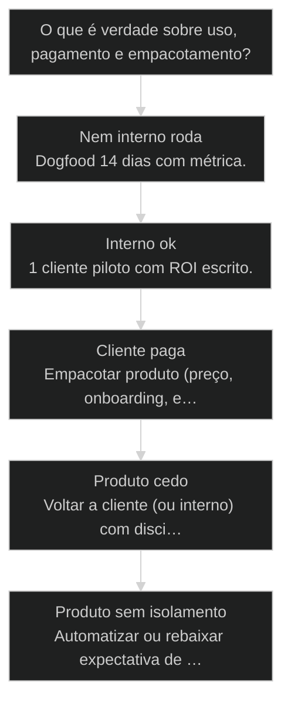
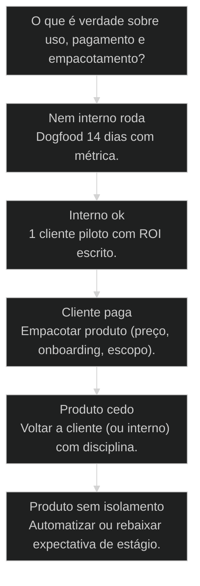

# Três estágios de monetização: interno → cliente → produto


## Mapa desta aula

Decisão-chave da aula — O que é verdade sobre uso, pagamento e empacotamento?



> Leia o diagrama antes do texto longo. Depois volte e confira.

> Interno valida operação. Cliente valida ROI. Produto escala o sistema. Pular estágio é fanfic de pitch deck.

**Objetivos de aprendizagem:**
- Mapear em qual estágio de monetização o trabalho atual está com evidência. _(analyze)_
- Definir o próximo passo de estágio com uma ação de 7 dias e prova. _(apply)_
- Identificar e vetar pulos de estágio sem prova (pricing page cedo, etc.). _(evaluate)_
- Montar checklist de passagem entre interno → cliente → produto. _(apply)_

---

## O que você consegue no fim desta aula

*G · Destino*

Destino claro antes de qualquer Stripe vazio.

Ao final desta aula você vai conseguir três coisas concretas:

1. Nomear teu **estágio atual** (interno / cliente / produto) sem autoengano.
2. Apontar a **prova** que te autoriza a ficar nele — ou a subir.
3. Escrever a **próxima ação de 7 dias** pro estágio seguinte.

Se você sair daqui com pricing page e zero case, a aula falhou. Monetização
madura sobe por **evidência**, não por ego de founder.

- **Objetivos da aula** (Mapear estágio com prova; Checklist de passagem; Ação de 7 dias pro próximo)
- **Resultado tangível**: Cartão: estágio · prova · veto · próximo passo.
- **Não é o destino**: Pular do zero pro produto porque 'o mercado é grande'.

---

## A fanfic do estágio produto

*P · Onde você está*

Empatia com quem quer cobrar SaaS sem ter operado.

Cara, o pitch deck te treinou a pular pro final. "Produto multi-tenant,
pricing em três tiers, GTM global." Por baixo: repo que nem o founder usa
no dia a dia e zero cliente pagando resultado.

Monetização tem escada. Pular degrau parece velocidade. É dívida de verdade.

Se você está aqui, provavelmente já sentiu:

- Stripe configurado, métrica de receita em zero.
- Demo linda, dogfood inexistente.
- "Cliente logo" — mas nem você opera o fluxo.

Beleza. A partir daqui: **interno valida, cliente valida ROI, produto escala**.

**Onde a maioria trava**
- Pricing page sem case
- Produto sem dogfood
- Cliente sem ROI negociado

**Onde o operador vai**
- Métrica de uso interno
- Piloto com critério de sucesso
- Empacotar só depois de repetir

---

## A escada de três estágios

*S · Rota*

Cada degrau tem prova. Sem prova, você não está nele.

**Interno** — você usa e prova. Dogfooding com métrica. Se nem você opera,
não venda. O valor ainda é aprendizado e eficiência interna.

**Cliente** — alguém paga o resultado. ROI negociado, entrega, case. Pode
ser serviço, piloto ou add-on. O dinheiro valida a dor.

**Produto** — muitos pagam o sistema empacotado: preço, onboarding, suporte,
isolamento. Escala o que já funcionou nos degraus anteriores.

Prior-art: três caminhos (65) escolhem a pista. Aqui você escolhe o **degrau
de cash e prova** dentro da pista — sem pular.

- **3**: estágios
- **1**: prova por degrau
- **0**: pulo por ego

- **status**: tres-estagios-de-monetizacao
- **meta**: escada=interno>cliente>produto
- **meta**: moeda=prova
- **ready**: ready to stage

**Legenda de cores**

O que cada cor sinaliza nesta aula

- **Interno** (signal): dogfood + métrica
- **Cliente** (insight): paga ROI
- **Produto** (bench): empacotado e escalável
- **Passagem** (action): checklist com evidência
- **Pulo** (pain): estágio declarado sem prova

**Como ler esta aula**

1. **Estágios**: O que conta como prova em cada um.
2. **Passagem**: Checklist de subida.
3. **Caso**: Quem pulou e voltou.
4. **Rota**: Mapear e avançar 7 dias.

---

## Prova por estágio — sem diploma de vaidade

Você está no estágio da evidência, não do slide.

**Interno — prova mínima**
- Fluxo roda ≥14 dias no teu próprio uso ou operação.
- Métrica de tempo/qualidade antes vs depois.
- Falhas conhecidas documentadas (não "funciona no meu notebook" mudo).

**Cliente — prova mínima**
- Pelo menos 1 pagante (piloto conta se há dinheiro ou contrato claro).
- ROI ou critério de sucesso acordado por escrito.
- Case com número (mesmo que N=1).

**Produto — prova mínima**
- Oferta empacotada (preço, escopo, onboarding).
- ≥2 compradores independentes no mesmo pacote (ou fila real com conversão).
- Suporte e isolamento não dependem de herói não documentado.

Se a "prova" é só feeling, você está no estágio de torcida — não de monetização.

- **1. Interno**: Dogfood com métrica e falhas nomeadas. [aprender]
- **2. Cliente**: Paga resultado com ROI negociado. [validar]
- **3. Produto**: Pacote, preço, onboarding, escala. [escalar]

> **Lei da prova**: O estágio é o da evidência mais fraca que você ainda não tem. Se falta case, não é produto — mesmo com logo no site.

---

## Checklist de passagem (e vetos)

Subir com prova. Descer com coragem.

**Interno → Cliente**
- Métrica interna estável o bastante pra prometer.
- Oferta de piloto com critério de sucesso e preço (mesmo simbólico).
- Dono de entrega (você ou squad) com capacidade real.

**Cliente → Produto**
- 2–3 entregas parecidas (repetição).
- Tempo/custo por cliente conhecido.
- Empacotamento que remove herói (onboarding, docs, automação mínima).

**Vetos de vaidade**
- Pricing page sem um pagante.
- Multi-tier sem um tier que vende.
- "Launch" sem dogfood.
- Case inventado ou anônimo sem número.

Descer de estágio não é humilhação — é realismo que salva caixa.

Regra de ouro do calendário: se a semana tem mais horas em landing, billing
e branding do que em prova de estágio, você está **administrando o fantasma
do produto futuro** em vez de subir de degrau. Inverta a alocação até a prova
existir — depois o Stripe e o site passam a ter o que mostrar.

- **Dogfood**: Usar o próprio sistema em produção real com métrica.
- **Piloto**: Engajamento limitado com critério de sucesso e preço/contrato.
- **Pulo de estágio**: Declarar produto/cliente sem a prova do degrau anterior.
- **Case com número**: História de resultado com métrica antes/depois, não depoimento vago.

> **Pergunta de 10 segundos**: Se um investidor ou cliente pedir 'mostra a prova deste estágio', o que você abre em 30 segundos? Se a resposta é um deck, ainda não é prova.

- **Uso interno** != **Produto**: Dogfood é estágio 1; produto exige compradores do pacote.
- **Lead interessado** != **Cliente**: Interesse não é pagamento nem ROI negociado.

---

## Caso: Stripe cedo, case tarde

Voltar um degrau salvou o negócio.

Founder lançou "SaaS de ops" com pricing de três tiers. Zero dogfood sério.
Dois trials fantasmas. Nenhuma métrica de ROI. Burn de atenção em billing e
landing — zero em operação real.

Reset de 30 dias:

1. **Descer para interno**: operar o fluxo na própria agência 14 dias.
2. **Medir**: horas de relatório 7h → 1h20.
3. **Subir para cliente**: um piloto pago com cláusula de 50% de corte de tempo.
4. **Só então** reabrir conversa de produto com o mesmo pacote duas vezes.

O Stripe voltou — com um tier e um case. Menos glamour. Mais verdade.

Lição operacional: descer de estágio dói o ego uma tarde. Pular de estágio
dói o caixa um trimestre. Escolha a dor curta.

**Reset de estágio**

1. **Admitir**: Sem prova de produto
2. **Dogfood**: 14 dias com métrica
3. **Piloto**: 1 cliente · ROI escrito
4. **Repetir**: 2º pacote igual
5. **Empacotar**: Produto de verdade

---

## Qual é a próxima ação de estágio?

Árvore curta pra não pular por ego.

**Árvore de decisão**
_Escolha pela prova mais fraca que falta — não pelo slide._



- **Nem interno roda** — Projeto na gaveta ou demo frágil.
  → _Dogfood 14 dias com métrica._
  Ex.: Repo parado, pitch ativo.
- **Interno ok** — Você usa com número de melhoria.
  → _1 cliente piloto com ROI escrito._
  Ex.: Automação na sua op com 50% menos tempo.
- **Cliente paga** — ROI claro e entrega repetível.
  → _Empacotar produto (preço, onboarding, escopo)._
  Ex.: 3 contratos parecidos.
- **Produto cedo** — Pricing page sem case / Stripe vazio.
  → _Voltar a cliente (ou interno) com disciplina._
  Ex.: Três tiers, zero pagante.
- **Produto sem isolamento** — Herói por cliente em 'SaaS'.
  → _Automatizar ou rebaixar expectativa de estágio._
  Ex.: Onboarding de 40h escondido.

**Gate:** Você consegue apontar a prova do estágio atual em uma frase verificável? — _Se a prova é 'vai dar certo', ainda é fanfic._

#### Rota subir
Com prova.
1. **Métrica estágio: O que prova onde está.
2. **Gap: O que falta pro próximo.
3. **Oferta: Piloto ou pacote.
4. **7 dias: Uma ação só.

#### Rota não pular
Disciplina de vaidade.
1. **Checklist: Provas mínimas.
2. **Veto: O que está proibido.
3. **Descer se preciso: Sem drama.
4. **Reconstruir: Degrau por degrau.

#### Rota empacotar
Cliente → produto.
1. **Repetição: O que se repete.
2. **Custo/cliente: Horas reais.
3. **Pacote: Escopo + preço.
4. **Onboarding: Sem herói.

---

## Nomeie o estágio (15 min)

Cartão de prova — não de ambição.

Vamos lá. Sem prova escrita, estágio é opinion. Quinze minutos.

- 1. **Estágio**: Marque: interno | cliente | produto — com uma frase de por quê.
- 2. **Prova**: 1 evidência verificável (métrica, contrato, case).
- 3. **Veto**: 1 coisa que você NÃO vai fazer até ter a prova do próximo.
- 4. **Próximo**: 1 ação de 7 dias que move de degrau (ou solidifica o atual).
- 5. **Risco**: O que acontece se você pular agora (caixa, reputação, foco).

**Funcionou se:**

- Estágio nomeado com prova, não com desejo.
- Há veto explícito de pulo de vaidade.
- Ação de 7 dias é concreta e agendável.

---

## Glossário sem fanfic de GTM

- **Estágio interno**: Você opera o sistema com métrica; ainda não há comprador externo do resultado.
- **Estágio cliente**: Alguém paga resultado com ROI ou critério de sucesso acordado.
- **Estágio produto**: Sistema empacotado com preço, onboarding e compradores repetíveis.
- **Pulo de estágio**: Declarar degrau superior sem a prova do inferior.

---

## Portão da aula

Você passou quando tem estágio nomeado + prova + próximo passo — sem pular
por ego. Monetização é escada. Pitch deck é elevador de mentira.

A IA é a seta. O X é seu — inclusive **admitir em qual degrau** você está.


> **GATE-MODULE (auto)**: GPS Goal/Position/Steps presentes · caso + do/dont · decisão · prática com evidência · glossário. Alvo DL ≥70 atingido na construção enrich-W4.

***


---

## Pergunte ao seu agente

```text
Use esta aula para classificar meu estágio pela evidência mais fraca que
ainda falta. Diferencie uso interno, cliente pagante e produto repetível.
Entregue: estágio atual, prova existente, prova ausente, veto e próximo gate.
```

## Evidência de conclusão

Registre estágio, prova, veto e próximo gate no [Decision Pack](../templates/decision-pack.md). Um nome, login ou landing page não contam como prova de produto.

## Origem curricular

Adaptação autocontida da aula 66 do AIOX Advanced. A fonte histórica permanece registrada em `source_path`; este curso é o dono da progressão atual.

## Navegação

[← Aula anterior](04-caminhos-de-produto.md) · [M2](../modulos/M2-distribuicao-formato-monetizacao.md) · [Curso](../README.md) · [Capstone →](06-capstone-decisao-de-productizacao.md)
