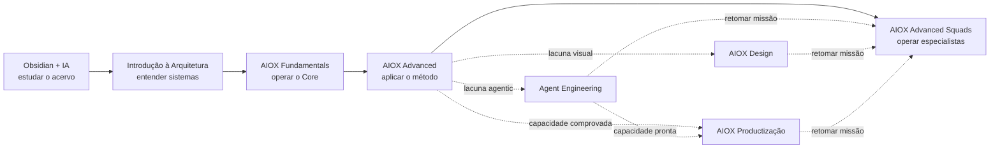

# Como estudar o acervo AIOX — trilhas por caso

> Use a formação comum para construir base; use diagnósticos para não repetir o que já domina; use especializações laterais somente quando uma missão revelar esse gargalo.

[⌂ Hub dos cursos](README.md) · [Jornada AIOX](../JORNADA-AIOX.md) · [MOC do acervo](MOC-Acervo-AIOX.md)

## A regra que evita atalhos falsos

Você não “pula” uma competência porque reconhece o vocabulário. Para cada etapa, escolha uma das duas ações:

1. **Estudar:** faça a rota indicada e produza a evidência de saída.
2. **Diagnosticar:** tente primeiro o projeto, capstone ou gate da etapa; se a evidência passar, avance. Se falhar, estude apenas as lacunas encontradas.

Arquitetura e AIOX Fundamentals continuam separados: a primeira prova que você **entende sistemas**; o segundo prova que você **opera o `aiox-core`**.

## A espinha comum

As setas contínuas são a jornada canônica. As pontilhadas são aprofundamentos laterais do quarto degrau — não novos pré-requisitos universais.

## Contrato de cada etapa

| Etapa | Estude quando… | Diagnóstico / evidência para avançar |
|-------|----------------|--------------------------------------|
| [Obsidian + IA](Obsidian-IA/README.md) | você se perde no vault, captura sem conexão ou não consegue preparar contexto | captura ou MOC justificado + Context Brief de estudo |
| [Introdução à Arquitetura de Sistemas](Introducao-a-Arquitetura-de-Sistemas/README.md) | API, estado, fila, worker, runtime, RLS ou trade-off ainda são caixas-pretas | arquitetura pequena explicável: fluxo, estado, falhas, segurança e três trade-offs |
| [AIOX Fundamentals](AIOX-Fundamentals/README.md) | ainda não instala/audita o Core nem escolhe o agent e o mecanismo corretos | projeto final: context pack + story + evidências + handoff reproduzível |
| [AIOX Advanced](AIOX%20Advanced/README.md) | a execução ainda improvisa problema, contexto, SDC, gates, determinismo ou brownfield | Capstone: fatia funcional, auditável e reproduzível |
| [AIOX Advanced Squads](AIOX-Advanced-Squads/README.md) | precisa escolher, ativar ou compor especialistas publicados | routing decision + briefings + artefatos + validation report + retrospectiva |

## Escolha sua trilha pelo caso

### Caso 1 — “Estou começando do zero e a linguagem técnica me trava”

**Percurso:** Obsidian + IA → Introdução à Arquitetura completa → AIOX Fundamentals → AIOX Advanced → AIOX Advanced Squads.

**Não pule:** o projeto de Arquitetura. Reconhecer termos não prova que você consegue seguir o fluxo de um sistema ou discutir trade-offs.

**Primeira evidência:** explique uma requisição do cliente ao banco, marque onde o estado muda e descreva uma falha possível.

### Caso 2 — “Já sou técnico, mas nunca usei AIOX”

**Percurso:** gate de Obsidian + IA → capstone diagnóstico de Arquitetura → AIOX Fundamentals → AIOX Advanced → AIOX Advanced Squads.

**Aceleração segura:** se o diagnóstico de Arquitetura passar, não repita as 24 aulas. Entre no Fundamentals, porque conhecer sistemas não prova domínio do Core.

**Primeira evidência:** instalar ou auditar o Core, escolher um agent por autoridade e fechar uma story pequena.

### Caso 3 — “Já opero o Core, mas meu trabalho ainda depende de improviso”

**Percurso:** valide os gates de Obsidian, Arquitetura e Fundamentals → AIOX Advanced completo → AIOX Advanced Squads.

**Foco:** problema antes da ferramenta, contexto, SDC, quality gates, determinismo proporcional ao risco e brownfield.

**Primeira evidência:** transformar uma intenção real em briefing, stories, entrega e validação reproduzível.

### Caso 4 — “Preciso usar um squad publicado agora”

**Percurso de estudo:** gate do Advanced → [aula 00 de Squads](AIOX-Advanced-Squads/aulas/00-como-usar-este-curso.md) → [Mapa de decisão](AIOX-Advanced-Squads/Mapa-de-decisao.md) → aula do squad → execução real.

**Se houver urgência:** você pode consultar o router para orientação antes de concluir o curso, mas isso não equivale a dominar ativação, maturidade, briefing e validação.

**Primeira evidência:** justificar o squad escolhido, rejeitar o vizinho mais provável e provar o resultado no projeto destino.

### Caso 5 — “Quero construir meu próprio agent, workflow, runner ou squad”

**Percurso:** formação comum até AIOX Advanced → [AIOX Agent Engineering](AIOX-Agent-Engineering/README.md) → retomar AIOX Advanced Squads quando a missão pedir operação de especialistas publicados.

**Foco lateral:** taxonomia da capacidade, research, REUSE > ADAPT > CREATE, orquestração, harness e produção.

**Primeira evidência:** uma capacidade mínima com contrato de execução, gates, runtime ou bloqueio diagnosticado e limites conhecidos.

### Caso 6 — “Minha dor é interface, design system ou AI slop”

**Percurso:** formação comum até o SDC do Advanced → [AIOX Design](AIOX-Design/README.md) → Squads 13–15 conforme a missão.

**Não use Design para:** substituir briefing, story, aceite ou quality gate do método.

**Primeira evidência:** `DESIGN.md` mínimo + componente classificado + variantes + aceite visual.

### Caso 7 — “Já tenho uma capacidade; quero oferta, distribuição ou monetização”

**Percurso:** prove que a capacidade funciona → [AIOX Productização](AIOX-Productizacao/README.md) → Squads 19–21 para executar copy, sales ou oferta.

Se a capacidade ainda depende da IDE, não tem contrato de execução ou não produz valor observável, faça antes AIOX Agent Engineering. Productização não corrige uma capacidade técnica inexistente.

**Primeira evidência:** decision pack com wedge, dor/ROI, formato, canal, experimento e critério de parada.

### Caso 8 — “Preciso entender ou mudar um sistema brownfield”

**Percurso:** diagnóstico de Arquitetura → Fundamentals → Advanced M4 + Capstone → Agent Engineering aulas 08–12 se faltar discovery profundo → Squads `code-anatomist`, `domain-decoder` ou `db-sage`.

**Não comece alterando código:** primeiro prove o fluxo real, as regras de domínio, o estado e os riscos da mudança.

**Primeira evidência:** mapa do sistema real + hipótese de mudança + risco + gate de não regressão.

### Caso 9 — “Já executo várias missões; o problema virou manter a operação”

**Percurso:** conclua uma execução real no Advanced Squads, repita-a e registre o atrito. Depois use o [diagnóstico Enterprise](../JORNADA-AIOX.md#teste-de-prontidão-para-o-enterprise).

Mais conteúdo não resolve automaticamente fragmentação de contexto, integrações, governança e observabilidade. A evidência aqui é o custo recorrente da operação, não uma preferência por uma oferta mais avançada.

## Como estudar uma aula

Use este ciclo curto; não acumule leitura sem recuperação nem prática:

1. **Antes:** escreva a pergunta que a aula precisa responder.
2. **Durante:** identifique uma decisão, uma fronteira e um erro que a aula evita.
3. **Sem consultar:** explique a ideia com um exemplo próprio.
4. **Prática:** execute o exercício ou aplique a decisão numa missão real.
5. **Evidência:** guarde o artefato pedido pelo gate.
6. **Captura:** registre o aprendizado em `notas/`, sem editar o conteúdo canônico.
7. **Handoff:** leve somente contexto e artefatos necessários à próxima etapa.

Se você não consegue explicar sem o texto aberto, ainda está reconhecendo, não recuperando. Se consegue explicar, mas não produzir a evidência, ainda falta transferência.

## Ritmo recomendado

- **Sessão de estudo:** uma pergunta + uma a três aulas relacionadas + uma prática.
- **Fim de módulo:** quiz sem consulta, correção dos erros e evidência do módulo.
- **Fim de curso:** projeto/capstone avaliado pela rubrica; terminar aulas não basta.
- **Depois da execução:** retrospectiva e nota de retorno para que o próximo ciclo comece com contexto melhor.

## Anti-rotas

- Ir direto ao Advanced porque “Fundamentals parece básico”, sem provar operação do Core.
- Tratar Introdução à Arquitetura como sinônimo de AIOX Fundamentals.
- Fazer Agent Engineering para toda missão que uma skill ou squad publicado já resolve.
- Entrar em Productização antes de existir capacidade e evidência de valor.
- Consumir todas as especializações como uma fila obrigatória.
- Declarar Squads concluído depois de ler o catálogo, sem execução real.

## Próximo passo agora

1. Escolha o caso que mais se parece com seu gargalo atual.
2. Abra o primeiro gate da rota, não a primeira aula por reflexo.
3. Tente produzir a evidência.
4. Estude somente o que a tentativa mostrou que falta.

Se dois casos parecerem igualmente urgentes, priorize o que bloqueia a **próxima evidência concreta**.
