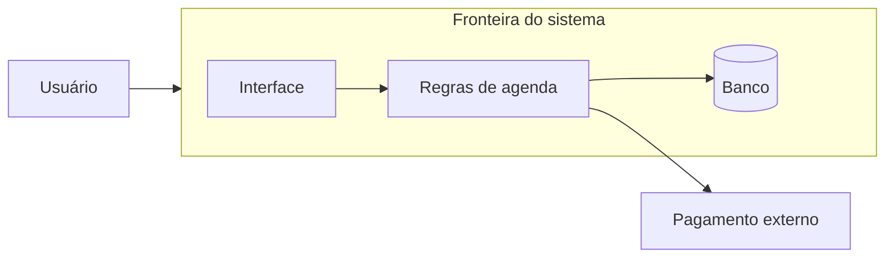

# Sistema, componente, fronteira e dependência

## Resultado

Você consegue desenhar o que está dentro do sistema, quais partes possuem responsabilidades distintas e de quais serviços externos ele depende.

## Mapa visual



## Modelo mental

Pense em um restaurante. O **sistema** é a operação que entrega uma experiência completa. Cozinha, salão e caixa são **componentes**: cada um possui uma responsabilidade e se comunica por interfaces reconhecíveis. A porta e as regras do estabelecimento formam a **fronteira**. O fornecedor de alimentos é uma **dependência externa**: necessário, mas não controlado pelo restaurante.

Em software:

- **Sistema:** conjunto de partes que coopera para entregar um resultado.
- **Componente:** parte com responsabilidade e interface próprias.
- **Fronteira:** decisão explícita sobre o que pertence ao sistema e o que fica fora.
- **Dependência:** recurso cuja disponibilidade ou contrato afeta seu componente.

Uma caixa em um diagrama só é útil quando você consegue responder: “o que ela decide?”, “o que recebe?”, “o que entrega?” e “quem a opera?”.

## Quando usar — e quando não usar

Use este mapa antes de discutir banco, framework, agentes ou cloud. Ele é especialmente importante quando duas pessoas usam a palavra “sistema” para escopos diferentes.

Não transforme cada arquivo ou função em componente arquitetural. O nível certo é aquele que torna responsabilidade e dependência visíveis. Detalhe demais esconde a decisão; detalhe de menos esconde o risco.

## Caso rápido

“Plataforma de cursos” não é uma caixa suficiente. Um primeiro mapa pode separar interface do aluno, catálogo, matrícula, pagamento, armazenamento de vídeo e provedor de e-mail. Pagamento e e-mail ficam fora da fronteira se forem serviços contratados. A equipe ainda é responsável por tratar a falha deles, mas não por implementar o interior deles.

Anti-padrão: desenhar somente produtos — “Next.js, Supabase, Stripe” — sem dizer qual responsabilidade cada um assume. Tecnologia não substitui arquitetura.

## Prática

Escolha um sistema seu e produza cinco linhas:

1. Resultado entregue.
2. Usuário principal.
3. Três a cinco componentes.
4. Duas dependências externas.
5. Uma frase dizendo o que está fora da fronteira.

Depois desenhe caixas e setas. Se uma caixa não tiver responsabilidade nomeável, revise.

## Pergunte ao seu agente

```text
Vou descrever um sistema. Faça perguntas apenas se a fronteira estiver ambígua. Depois proponha um diagrama com no máximo 7 componentes, separando sistema próprio e dependências externas. Para cada caixa, diga responsabilidade, entrada e saída. Não escolha tecnologia ainda.
```

## Evidência de conclusão

Diagrama com fronteira visível, componentes nomeados por responsabilidade e dependências externas diferenciadas. Você passou se outra pessoa consegue apontar onde o seu controle termina.

Fonte: [Azure Architecture Center — Architecture styles](https://learn.microsoft.com/en-us/azure/architecture/guide/architecture-styles/).

[Curso](../README.md) · [Próxima: cliente e servidor](02-cliente-servidor-frontend-backend.md)
