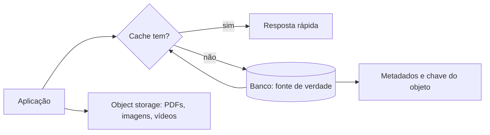

# Cache, arquivos e object storage

## Resultado

Você decide onde guardar verdade estruturada, cópia aceleradora e conteúdo grande sem transformar o cache em banco secreto.

## Mapa visual



## Modelo mental

**Cache** é uma cópia descartável usada para reduzir latência ou carga. Se apagá-lo destrói a verdade do negócio, ele não era apenas cache.

**Arquivo local** pertence ao filesystem de uma máquina ou processo. Pode ser útil para temporários, configuração e desenvolvimento, mas frequentemente não sobrevive a troca de instância ou escala horizontal.

**Object storage** guarda blobs — imagens, PDFs, vídeos, backups — endereçados por chave. O banco normalmente guarda metadados, proprietário, status e a referência ao objeto; não precisa carregar todo o binário na mesma tabela.

## Quando usar — e quando não usar

Use cache quando existe leitura repetida, dado derivável e estratégia de expiração/invalidação. Use object storage para conteúdo grande que precisa sobreviver independentemente da instância.

Não adicione cache sem medir gargalo. Invalidação incorreta entrega dado velho com velocidade. Não use disco efêmero como arquivo permanente em ambiente distribuído. E não exponha diretamente um objeto privado sem autorização ou URL temporária adequada.

## Caso rápido

Uma plataforma guarda vídeo no object storage, título e proprietário no banco e uma lista de cursos populares em cache por cinco minutos. Se a lista some, é recalculada. Se o vídeo some, há perda de dado — portanto ele precisa de persistência e política de backup.

Anti-padrão: gravar sessão importante apenas na memória de uma instância. O próximo request pode cair em outra instância e “esquecer” o usuário.

## Prática

Classifique dez dados do seu sistema em:

- fonte de verdade estruturada;
- objeto/blob;
- cache derivável;
- temporário descartável.

Para cada cache, escreva: chave, origem, TTL e como invalida.

## Pergunte ao seu agente

```text
Classifique estes dados entre banco, object storage, cache e temporário. Para cada escolha, diga fonte de verdade, duração, custo de perda e estratégia de invalidação. Recuse cache se eu não apresentar um gargalo plausível.
```

## Evidência de conclusão

Inventário em que todo dado tem dono, persistência e custo de perda; nenhum cache ou filesystem efêmero contém verdade insubstituível.

Fonte: [Redis — Client-side caching](https://redis.io/docs/latest/develop/reference/client-side-caching/).

[Anterior](05-banco-schema-indice-transacao.md) · [Quiz M2](../avaliacoes/Quiz-M2-dados-e-estado.md) · [Próxima: contratos](07-json-yaml-markdown-contratos.md)
