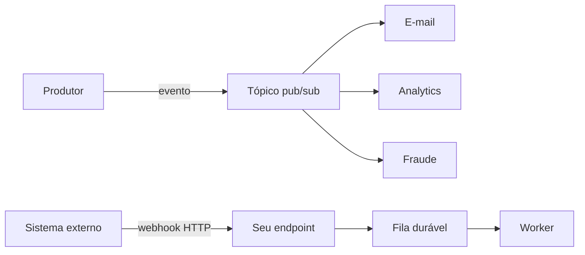

# Webhook, fila, evento e pub/sub

## Resultado

Você escolhe um mecanismo de comunicação assíncrona sem tratar webhook, fila e evento como sinônimos.

## Mapa visual



## Modelo mental

- **Webhook:** chamada HTTP enviada a um endereço cadastrado quando algo acontece. É um mecanismo de entrega entre sistemas.
- **Fila:** buffer de mensagens/trabalhos consumidos normalmente por um de vários workers. Ajuda a nivelar carga e reprocessar.
- **Evento:** registro de um fato passado, como `PagamentoAprovado`.
- **Pub/sub:** um produtor publica em um tópico e múltiplos assinantes recebem cópias segundo suas assinaturas.

Um webhook pode receber um evento e colocá-lo em fila. Esses conceitos se compõem; não competem necessariamente.

## Quando usar — e quando não usar

Use webhook para receber notificações de um sistema externo. Use fila quando o trabalho precisa esperar, sobreviver e ser distribuído. Use pub/sub quando vários consumidores independentes reagem ao mesmo fato.

Não confie que uma entrega acontecerá exatamente uma vez. Redes repetem, atrasam e reordenam. Não publique eventos com nomes genéricos como `dados_atualizados` sem identidade, versão e significado. E não use pub/sub quando existe um único comando com um único dono e resposta necessária.

## Caso rápido

O gateway envia webhook de pagamento. Seu endpoint valida assinatura, registra o `event_id`, responde rápido e coloca trabalho em fila. Um worker atualiza o pedido. Depois, o domínio publica `PagamentoConfirmado`, consumido por e-mail e analytics.

Anti-padrão: executar toda a lógica dentro do webhook antes de responder. O provedor pode considerar timeout e reenviar, multiplicando efeitos.

## Prática

Desenhe um evento do seu sistema com produtor, nome no passado, identificador, payload mínimo e consumidores. Defina o que cada consumidor faz se receber o mesmo evento duas vezes.

## Pergunte ao seu agente

```text
Revise este fluxo assíncrono. Diferencie webhook, fila, evento e pub/sub; encontre ausência de validação, durabilidade, deduplicação, retry e dead-letter. Proponha o mecanismo mínimo suficiente.
```

## Evidência de conclusão

Diagrama em que cada mensagem tem produtor, destino, durabilidade, consumidor, política de repetição e evidência de processamento.

Fontes: [Azure — Background jobs](https://learn.microsoft.com/en-us/azure/architecture/best-practices/background-jobs) e [Microservices architecture](https://learn.microsoft.com/en-us/azure/architecture/microservices/).


## Âncora no acervo

- [Glossário](../Glossario.md)
- [Mapa de termos](../Mapa-de-termos.md)

## Navegação

- Curso: [README](../README.md)
- Módulo: [M3](../modulos/M3-contratos-e-comunicacao.md)
- Anterior: [08-sincrono-assincrono.md](08-sincrono-assincrono.md)
- Próxima: [10-processo-task-job-worker-runner.md](10-processo-task-job-worker-runner.md)
