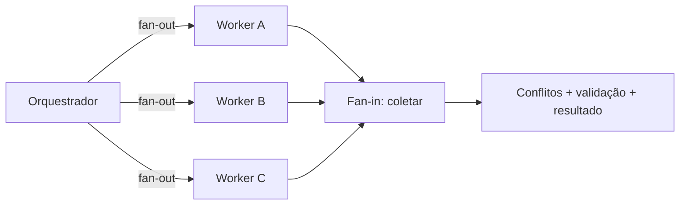

# Concorrência, paralelismo, fan-out e fan-in

## Resultado

Você divide trabalho independente, evita colisão de ownership e define como os resultados voltam a formar uma entrega única.

## Mapa visual



## Modelo mental

**Concorrência** significa que vários trabalhos progridem no mesmo intervalo, mesmo que alternem o uso de um recurso. **Paralelismo** significa execução simultânea real em recursos diferentes.

**Fan-out** abre o leque: uma origem despacha N ramos independentes. **Fan-in** fecha o leque: espera ou coleta resultados, detecta falhas/conflitos, sintetiza e valida a saída final.

O speedup real não termina quando o worker mais rápido responde:

```text
tempo paralelo real = maior tempo de ramo + fan-in + conflitos + validação
```

Sem fan-in, você tem resultados soltos, não uma entrega.

## Quando usar — e quando não usar

Paralelize quando as tarefas são independentes, possuem ownership disjunto e o custo de convergência é menor que o ganho. Use fan-out para múltiplas fontes, arquivos ou perspectivas; sempre defina fan-in antes do spawn.

Não paralelize uma cadeia `schema → API → UI` como se não houvesse dependência. Não dê o mesmo arquivo ou registro mutável a dois workers sem coordenação. E não use dez agentes para uma tarefa de dois minutos.

## Caso rápido

Três revisores podem avaliar segurança, testes e acessibilidade do mesmo artefato em paralelo se não editarem diretamente. No fan-in, um responsável reúne findings, remove duplicatas, resolve contradições e fecha um veredito. Se os três editarem o mesmo arquivo, o fan-in vira merge manual e pode apagar conclusões.

Anti-padrão: “último writer wins”. O ramo que termina por último não deve apagar resultados válidos dos demais.

## Prática

Escolha seis tarefas e faça um grafo:

1. aresta quando existe dependência ou recurso compartilhado;
2. agrupe tarefas sem aresta em um fan-out;
3. defina ownership de cada ramo;
4. escreva a barreira de fan-in;
5. defina merge order e quality gate.

## Pergunte ao seu agente

```text
Analise estas tarefas para execução sequencial, paralela ou híbrida. Monte o grafo de dependências e overlap, proponha fan-out apenas para ramos independentes e defina o fan-in com coleta, conflitos, ordem e quality gate. Calcule o wall-clock incluindo convergência.
```

## Evidência de conclusão

Plano no qual cada ramo tem dono e escopo, nenhuma colisão fica implícita e o fan-in produz um único artefato validado.

Fontes: [Azure — Scale out](https://learn.microsoft.com/en-us/azure/architecture/guide/design-principles/scale-out) e [OpenAI Agents SDK — orchestration](https://openai.github.io/openai-agents-python/multi_agent/). Proveniência: [mapeamento](../PROVENIENCIA.md).

[Anterior](11-workflow-pipeline-batch-stream.md) · [Quiz M4](../avaliacoes/Quiz-M4-execucao-e-orquestracao.md) · [Próxima: escala](13-escala-load-balancing.md)
