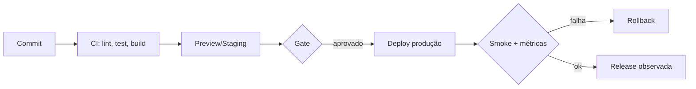

# CI/CD, deploy e rollback

## Resultado

Você desenha o caminho de uma mudança até produção com gates, ambiente, verificação e retorno seguro.

## Mapa visual



## Modelo mental

**CI** integra mudanças frequentemente e executa verificações automáticas. **CD** automatiza a preparação e, conforme a política, a entrega ou implantação.

**Deploy** coloca uma versão em um ambiente. Não prova sozinho que o valor funciona. **Smoke test** verifica o caminho mínimo após implantação. **Rollback** retorna a uma versão conhecida — mas pode não reverter dados; migrations exigem estratégia própria.

Ambientes separam risco: desenvolvimento favorece velocidade; staging ensaia integração; produção serve usuários reais e exige controles.

## Quando usar — e quando não usar

Automatize checks repetíveis e mantenha gates proporcionais ao risco. Registre versão, ambiente e histórico. Defina rollback antes do deploy e monitore rollout.

Não use “pipeline verde” como prova de produto correto se os testes não cobrem valor. Não compartilhe secrets indiscriminadamente entre ambientes. Não execute migration destrutiva irreversível junto com release sem plano de compatibilidade.

## Caso rápido

Uma release adiciona coluna. Primeiro o banco aceita versões antiga e nova; depois o código passa a escrever; dados são migrados; somente por último remove-se a estrutura antiga. Isso permite rollback do código sem tornar a versão anterior incompatível.

Anti-padrão: deploy sexta-feira sem owner, smoke, métricas ou caminho de volta.

## Prática

Desenhe pipeline com triggers, checks, artefato, ambientes, approvals, secrets, smoke, observação e rollback. Inclua uma mudança de schema e explique compatibilidade.

## Pergunte ao seu agente

```text
Revise este caminho de release. Encontre checks ausentes, secrets amplos, migration incompatível, deploy sem smoke e rollback fictício. Separe evidência de CI, staging e produção.
```

## Evidência de conclusão

Runbook no qual toda versão é identificável, o deploy tem gate e smoke, e rollback foi testado ou possui limitação explícita.

Fontes: [GitHub — Continuous integration](https://docs.github.com/en/actions/get-started/continuous-integration) e [Deployment environments](https://docs.github.com/en/actions/concepts/workflows-and-actions/deployment-environments). Proveniência: [mapeamento](../PROVENIENCIA.md).

[Anterior](17-runtime-harness-ambiente-container.md) · [Quiz M6](../avaliacoes/Quiz-M6-operacao-e-observabilidade.md) · [Próxima: segurança](19-autenticacao-autorizacao-secrets.md)
