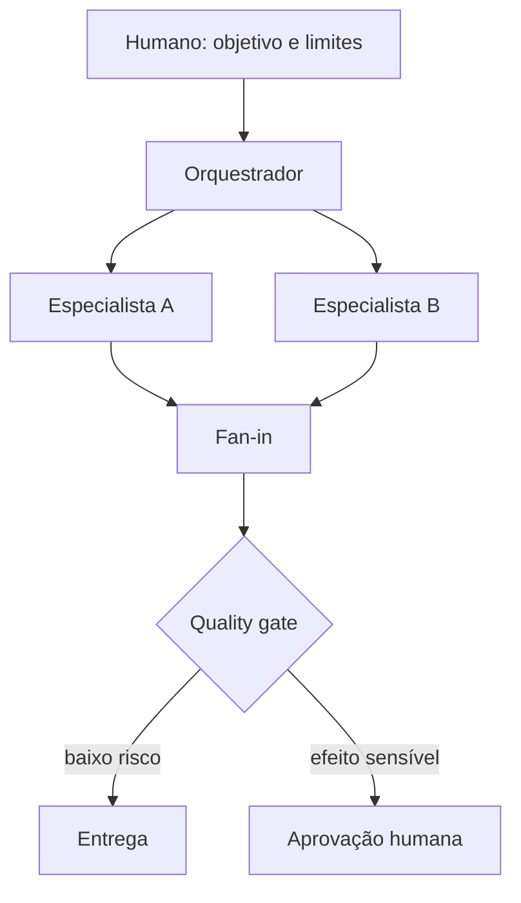

# Orquestrador, squad, human-in-the-loop e quality gate

## Resultado

Você distribui autonomia sem perder autoridade, convergência e evidência final.

## Mapa visual



## Modelo mental

**Orquestrador** mantém controle da missão, escolhe especialistas, passa contexto e reúne resultados. Um **squad** combina especialistas, tasks, workflows e gates para uma capacidade maior que uma resposta isolada.

**Human-in-the-loop** coloca decisão humana em pontos específicos: ambiguidade material, gasto, publicação, acesso sensível ou exceção. Não significa aprovar cada token; significa preservar autoridade onde o risco exige.

**Quality gate** verifica entrada ou saída antes de mudar o estado. Guardrail pode bloquear input, output ou tool call; gate também pode exigir teste, artefato ou aprovação.

## Quando usar — e quando não usar

Use múltiplos agentes quando especialização ou independência produz ganho que supera coordenação. Defina dono final, contratos de handoff e fan-in. Coloque humano antes do efeito irreversível ou externo.

Não monte squad para uma tarefa estreita que uma skill resolve. Não permita que especialistas editem o mesmo estado sem ownership. Não use “humano no loop” como botão decorativo depois que e-mail, deploy ou pagamento já aconteceu.

## Caso rápido

Um squad de lançamento pode ter pesquisa, copy e revisão jurídica. O orquestrador fornece o mesmo briefing, coleta outputs e submete a um gate. Publicar campanha exige aprovação humana; gerar rascunhos não. A autoridade é proporcional ao efeito.

Anti-padrão: agente revisa o próprio trabalho e declara gate aprovado sem critério externo.

## Prática

Desenhe uma missão com: orquestrador, dois especialistas, contratos de entrada/saída, ownership, fan-in, quality gate e dois pontos de intervenção humana. Remova um agente se não houver especialização real.

## Pergunte ao seu agente

```text
Projete a orquestração mínima para esta missão. Compare skill única, workflow e squad. Se usar especialistas, defina handoffs, ownership, fan-in, guardrails, quality gate e pontos de aprovação humana antes de efeitos externos.
```

## Evidência de conclusão

Mapa em que existe um dono da resposta final, nenhuma ação sensível escapa de autoridade e o gate exige evidência observável.

Fontes: [OpenAI — Agent orchestration](https://openai.github.io/openai-agents-python/multi_agent/), [Guardrails](https://openai.github.io/openai-agents-python/guardrails/) e [Anthropic — Trustworthy agents](https://www.anthropic.com/research/trustworthy-agents).

[Anterior](22-modelo-contexto-memoria-tool-skill.md) · [Próxima: capstone](24-capstone-arquitetura-agentic.md)
