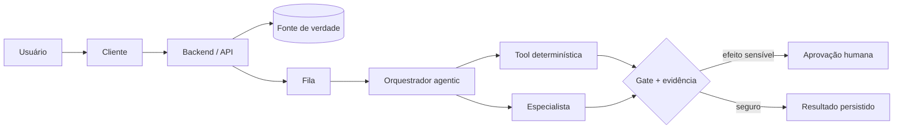

# Capstone: desenhar e defender uma arquitetura agentic

## Resultado

Você produz uma arquitetura pequena, coerente e revisável, explicando decisões sem se esconder atrás de tecnologia ou IA.

## Mapa visual



## Modelo mental

Arquitetura é um conjunto de decisões difíceis de mudar, expostas para que outras pessoas compreendam limites, fluxos e trade-offs. Um bom diagrama não é o que tem mais caixas: é o que permite responder onde o estado vive, como uma operação termina, como falha e quem possui autoridade.

Use o percurso do curso como checklist de raciocínio:

1. fronteira e componentes;
2. estado e fonte de verdade;
3. contratos e comunicação;
4. execução e convergência;
5. escala e falhas;
6. observabilidade e mudança;
7. segurança e isolamento;
8. autonomia agentic e controle humano.

## Quando usar — e quando não usar

Use o capstone antes de construir uma feature que cruza várias camadas ou introduz agente com tools. Ele serve como hipótese revisável, não documento sagrado.

Não desenhe microsserviços, filas e múltiplos agentes porque o template possui essas caixas. Apague tudo que não responde a uma necessidade. Não declare “produção pronta” sem teste no ambiente real.

## Caso rápido

Processamento de contratos: upload vai para object storage; metadados e estado ficam no banco; job entra em fila; workers extraem partes em fan-out; orquestrador reúne no fan-in; humano aprova cláusulas de alto risco; resultado e evidências são persistidos; logs/traces correlacionam `job_id`; retry é idempotente.

Trade-off: começar com um monólito modular e fila gerenciada reduz operação. Separar serviços só ganha quando extração e revisão precisam de escala/deploy independentes.

## Prática

Execute o [Projeto Integrador](../Projeto-Integrador.md). Depois faça três revisões:

- simplificação: o que pode ser removido?
- falha: onde duplicação, timeout ou estado órfão aparecem?
- autoridade: qual tool ou efeito precisa de aprovação?

Pontue pela [Rubrica](../Rubrica.md) antes de pedir opinião ao agente.

## Pergunte ao seu agente

```text
Faça uma revisão adversarial desta arquitetura. Primeiro reconstrua o fluxo em suas palavras. Depois procure fronteira ambígua, estado sem dono, contrato frágil, fan-in ausente, retry não idempotente, observabilidade genérica, acesso excessivo e agente com autonomia sem gate. Para cada finding, peça evidência e ofereça a alternativa mais simples.
```

## Evidência de conclusão

Arquitetura com pelo menos 16/20 na rubrica, três trade-offs explícitos e nenhuma caixa que o autor seja incapaz de explicar. A entrega deve sobreviver a uma revisão adversarial sem depender de “a IA recomendou”.

Fontes consolidadas: [Fontes técnicas primárias](../FONTES.md). Proveniência: [mapeamento curricular](../PROVENIENCIA.md).

## Handoff para AIOX Fundamentals

Leve o diagrama, os três trade-offs e as dúvidas abertas para `cursos/AIOX-Fundamentals/README.md`. A próxima etapa não reensina arquitetura: ela mostra onde contexto, agents, tasks, workflows e gates vivem no `aiox-core`.

[Anterior](23-orquestrador-squad-human-in-loop.md) · [Quiz M8](../avaliacoes/Quiz-M8-sistemas-com-agentes.md) · [Projeto Integrador](../Projeto-Integrador.md)
