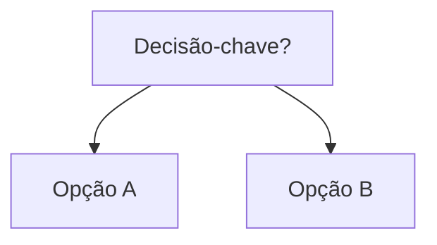

# <Título>

[↑ Curso](../README.md)

## Resultado

_DRAFT: resultado observável._

## Mapa visual



> Leia o diagrama antes do texto longo.

## Quando usar — e quando não usar

**Use quando:** _DRAFT_

**Não use quando:** _DRAFT_

## Prática

_DRAFT_

**Funcionou se:** _DRAFT_

## Pergunte ao seu agente

```text
Contexto: _DRAFT_
Pedido: _DRAFT_
Evidência que espero: _DRAFT_
```

## Evidência de conclusão

_DRAFT_

## Navegação

[← Anterior](00-stub.md) · [↑ Curso](../README.md) · [Próxima →](02-stub.md)
