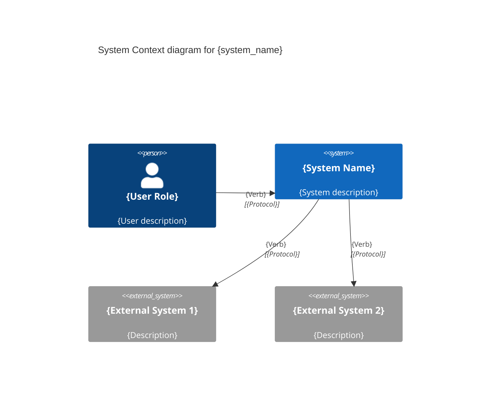

# C4 System Context Diagram — Phase 1
<!-- Code Anatomist v3.0.0 -->
<!-- Generated by: simon-brown (C4 Model) -->

## System Context: {system_name}

## External Systems Inventory

| System | Type | Protocol | Purpose |
|--------|------|----------|---------|
| {ext1} | {SaaS/API/DB} | {REST/SQL/gRPC} | {purpose} |

## Technology Inventory

| Component | Technology | Version |
|-----------|------------|---------|
| {component} | {tech} | {version} |

## Confidence

- Diagram source: {tool-extracted | LLM-inferred}
- Confidence: {HIGH | MEDIUM | LOW}
