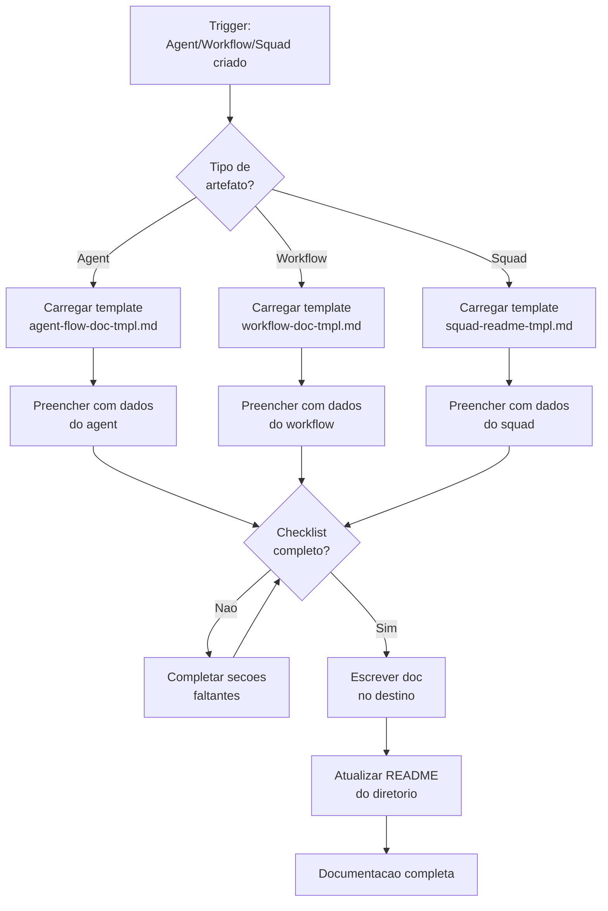

# Create Documentation

## Task Anatomy

| Field | Value |
|-------|-------|
| **Task ID** | `create-documentation` |
| **Version** | `2.0.0` |
| **Status** | `active` |
| **Responsible Executor** | `squad-chief` |
| **Execution Type** | `Worker` |

<!-- AIOX_CONTRACT -->
<!-- Domain: Operational -->
<!-- atomic_layer: Atom -->
<!-- Input: request::create_documentation -->
<!-- Output: artifact::create_documentation -->
<!-- pre_condition: artefato criado (agent, workflow ou squad) AND template de documentacao correspondente (SC-DP-*) acessivel -->
<!-- post_condition: documentacao gerada usando template correto (agent-flow-doc, workflow-doc ou squad-readme) e persistida -->
<!-- performance: deterministic Worker, < 30s, template-driven sem LLM, fail-loud se template ausente -->
<!-- Completion Criteria: documentacao gerada com template SC-DP-* AND coherence >= 0.95 AND artefato documentado -->
<!-- error_handling: fail-loud se template ausente, raise on coherence < 0.95, persist error context -->

## Inputs

- request::create_documentation

---

**Domain:** `Operational`
**Model:** N/A (Worker -- no LLM needed)
**Haiku Eligible:** N/A (Worker task)
**Squad:** squad-creator
**Phase:** Operationalization (Fase 3 do pipeline)
**Pattern:** SC-DP-* (Documentation Patterns)

## Accountability

```yaml
accountability:
  human: squad-operator
  scope: review_only
```

## Purpose

Criar documentacao completa e padronizada para cada artefato do squad-creator.

**REGRA ABSOLUTA:** Nenhum agent, workflow ou squad e considerado completo sem documentacao no padrao especificado.

---

## Trigger

### Automatica

Triggered automaticamente apos:
- `*create-agent` -> Cria agent-flow doc
- `*create-workflow` -> Cria workflow doc
- `*create-squad` -> Cria/atualiza README

### Manual

```
*create-doc {nome-do-artefato}
```

---

## Veto Conditions

| Trigger | Acao |
|---------|------|
| Agent criado sem agent-flow doc | **VETO** - criar documentacao antes de marcar done |
| Workflow criado sem workflow doc | **VETO** - criar documentacao antes de marcar done |
| Squad criado sem README completo | **VETO** - criar README antes de marcar done |
| Doc sem diagrama Mermaid | **VETO** - adicionar diagrama |
| Doc sem troubleshooting | **VETO** - adicionar secao |

---

## Roteamento por Tipo de Artefato

| Artefato Criado | Tipo de Doc | Template | Destino |
|-----------------|-------------|----------|---------|
| Agent | Agent Flow Doc | `agent-flow-doc-tmpl.md` | `docs/guides/aiox-agent-flows/{agent}-system.md` |
| Workflow | Workflow Doc | `workflow-doc-tmpl.md` | `docs/guides/aiox-workflows/{workflow}-workflow.md` |
| Squad | README | `squad-readme-tmpl.md` | `squads/{squad}/README.md` |

---

## Conteudo Obrigatorio por Tipo

### SC-DP-001: Agent Flow Doc

| Secao | Obrigatorio |
|-------|-------------|
| Visao geral com proposito | SIM |
| Lista completa de arquivos | SIM |
| Flowchart Mermaid do sistema | SIM |
| Mapeamento comando -> task | SIM |
| Diagrama de colaboracao | SIM |
| Best practices | SIM |
| Troubleshooting (3+ problemas) | SIM |
| Referencias | SIM |
| Changelog | SIM |

### SC-DP-002: Workflow Doc

| Secao | Obrigatorio |
|-------|-------------|
| Visao geral com objetivo | SIM |
| **3 diagramas Mermaid** (flowchart, state, sequence) | SIM |
| Steps detalhados com inputs/outputs | SIM |
| Veto conditions por step | SIM |
| Agentes participantes com comandos | SIM |
| Mapa de tasks por fase | SIM |
| Pre-requisitos | SIM |
| Entradas e saidas do workflow | SIM |
| Pontos de decisao com diagrama | SIM |
| Condicoes de bloqueio (HALT) | SIM |
| Troubleshooting (3+ problemas) | SIM |
| Changelog | SIM |

### SC-DP-003: Squad README

| Secao | Obrigatorio |
|-------|-------------|
| Descricao clara do proposito | SIM |
| Tabela de agents com papeis | SIM |
| Estrutura de diretorios | SIM |
| Quick start funcional | SIM |
| Lista de workflows | SIM |
| Comandos por agent | SIM |
| Veto conditions | SIM |
| Links para docs completas | SIM |

---

## Execution Flow



---

## Integracao no Pipeline

| Fase | Responsavel | Acao | Task |
|------|-------------|------|------|
| 1 | @squad-chief | Descobre dominio e contexto | `create-squad-discover.md` |
| 2 | @squad-chief | Gera artefatos | `create-squad-build.md` |
| **3** | **@squad-chief** | **Documenta** | **`create-documentation.md`** |
| 4 | @squad-chief | Valida squad final | `create-squad-validate.md` |

---

## Output Schema

```yaml
documentation_output:
  artefato:
    name: string
    type: agent|workflow|squad
    version: string
  documento:
    pattern: SC-DP-001|SC-DP-002|SC-DP-003
    template_used: string
    path: string
    sections_completed: number
    total_sections: number
  diagramas:
    - type: flowchart|state|sequence
      presente: boolean
  validacao:
    checklist_score: percentage
    troubleshooting_count: number
    mermaid_present: boolean
  metadata:
    generated_date: string
    generator: "squad-chief"
    task: create-documentation
```

---

## Templates

| Pattern ID | Nome | Arquivo |
|------------|------|---------|
| SC-DP-001 | Agent Flow Documentation | `templates/agent-flow-doc-tmpl.md` |
| SC-DP-002 | Workflow Documentation | `templates/workflow-doc-tmpl.md` |
| SC-DP-003 | Squad README | `templates/squad-readme-tmpl.md` |

---

## Completion Criteria

| Criterio | Obrigatorio |
|----------|-------------|
| Doc criada no path correto | SIM |
| Template seguido 100% | SIM |
| Diagramas Mermaid presentes | SIM |
| Troubleshooting com 3+ itens | SIM |
| README do diretorio atualizado | SIM |
| Checklist de qualidade 100% | SIM |

**Coherence Threshold:** `>= 0.95` | **Error Behavior:** `raise` (no silent failure)
